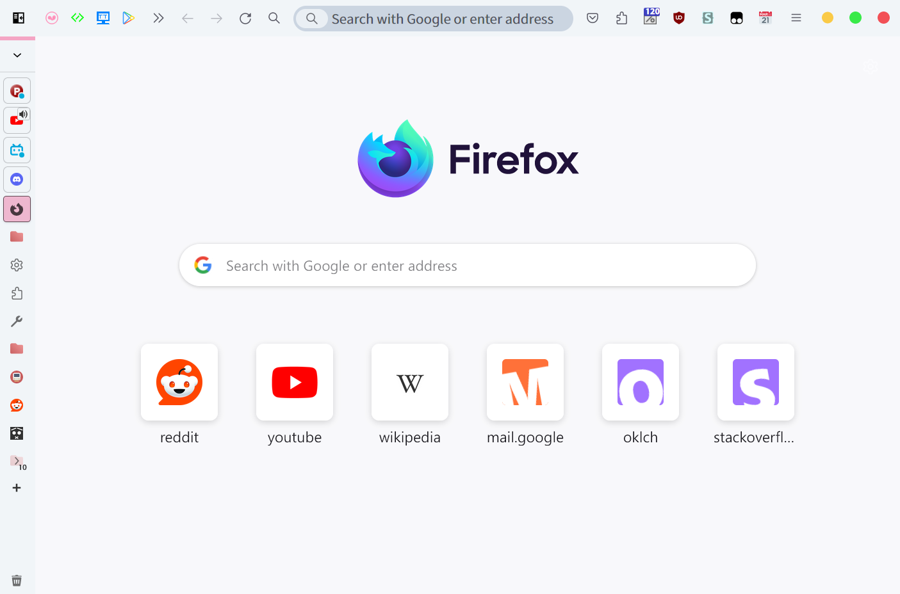
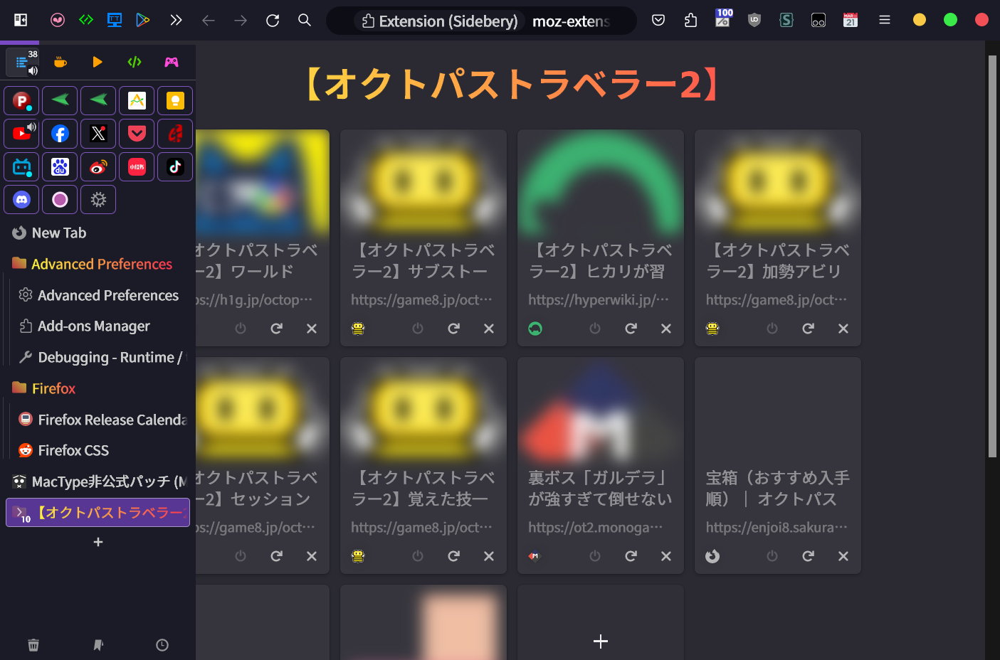

# FlexFox

 
 
 
 

 

A customizable Firefox theme inspired by [VerticalFox](https://github.com/christorange/VerticalFox), [EdgyArc-fr](https://github.com/artsyfriedchicken/EdgyArc-fr), [Edge-Frfox](https://github.com/bmFtZQ/edge-frfox), [ArcWTF](https://github.com/KiKaraage/ArcWTF), [shimmer](https://github.com/nuclearcodecat/shimmer) and [firefox-csshacks](https://github.com/MrOtherGuy/firefox-csshacks). FlexFox offers extensive flexibility and feature options to enhance your browsing experience.

## What's New

**v1.1.0**:
- Fixed background image clipping on hover with bookmarks toolbar auto-hide enabled and theme background active.
- Adjusted zoom level text brightness.
- Corrected window controls positioning in Nightly (v135). Resolved compatibility with `customtitlebar` after `tabsintitlebar` deprecation.
- Added preference `uc.flex.disable-sidebery-autohide` to disable Sidebery auto-collapse.

   

   
💬 <b>Experience the new feature in action</b>

   
FlexFox with the dark theme and <code>uc.flex.disable-sidebery-autohide</code> enabled:

   
   
Combined with <code>uc.flex.fully-hide-toolbox</code>:

   
   

> [!IMPORTANT]
> Before importing the v1.1.0 version of `sidebery-styles.json`, clear the old styles first. Open Sidebery settings (via the gear icon) > `Styles editor` > clear all styles under both the `Sidebar` and `Group page` sections, then import the new styles.  
> Importing `sidebery-settings.json` may occasionally cause panel data loss. Be sure to create a snapshot backup of your panel data beforehand.

**v1.0.4**:
- The zoom level icon is now always visible when the webpage is not at the default zoom level.
- The bookmark star icon is now always visible when the webpage has already been bookmarked.  
     
   

<b>Previous Updates</b>

**v1.0.3**:
- Optimized performance when the `uc.flex.allow-addons-to-change-toolbar-color` option is enabled, improving speed by 1.4x compared to v1.0.2.

**v1.0.2**:
- Improve URL bar switcher and chicklet visuals.  
- Add option `uc.flex.allow-addons-to-change-toolbar-color` to allow themes and addons to customize toolbar background image and color.  
   

**v1.0.1**:
- Fixed the issue where the tracking protection icon in the URL bar was not hidden.
- Added `uc-pdf.js.css`.
- Added LICENSE file.

**v1.0.0**:
- Performance has improved dramatically, running 100x faster than previous versions. Opening the context menu now only adds **16ms** of latency compared to the default interface.

> [!IMPORTANT]
> If you previously used FlexFox on Firefox versions earlier than v133, reset all settings by navigating to `about:config`, searching for `uc.flex.`, and removing all entries before updating.

## Previews

  
  
*Above: Light and Dark theme previews of FlexFox in action.*

## Features

- **Minimal interface and lightweight performance**
  - Simplifies the UI and minimizes resource usage.

- **Auto-hide toolbars**
  - Automatically hides the horizontal tab bar, bookmarks toolbar, all top toolbars, and Sidebery's sidebar.
  - Expands them when hovered.

- **Customizable toolbar visibility**
  - Choose which toolbars and Sidebery sidebar to show or hide.
  - With all toolbars and sidebar hidden, the browser displays only webpage content, offering a full-screen experience without full-screen mode.

- **Trigger zones for hidden toolbars**
  - Easily expand hidden toolbars or Sidebery sidebar from window edges.
  - Works even when the window is not maximized.
  - Adjust trigger sensitivity to your preference.

- **Sidebery compatibility**
  - Works seamlessly with or without Sidebery installed.
  - Automatically hides the horizontal tab bar when Sidebery is active, and restores it when Sidebery is inactive.
  - Supports placing Sidebery's sidebar on either the left or right, adapting to your preferred layout.

- **Integration with Title Bar and Menu Bar**
  - FlexFox adjusts its layout for compatibility when these elements are enabled.

- **Overlay toolbars**
  - Expanded toolbars overlay webpage content without causing layout shifts.
  - Works smoothly even in full-screen mode.

- **Redesigned Findbar**
  - Relocated to the top of the browser with a compact, floating design.
  - Customize its position (left or right).
  - Auto-hides when unfocused by default (can be disabled in options).

- **Compact extension panel**
  - Displays only extension icons.
  - Right-click for extension options.
  - Alternatively, switch to a condensed panel retaining extension labels.

- **Improved Sidebery folding**
  - Auto-collapses Sidebery's navigation and pinned tab sections.
  - Expanded sections maintain vertical alignment to prevent layout jumps and minimize cursor adjustments.

## Installation

> [!IMPORTANT]
> 1. Install [Sidebery](https://addons.mozilla.org/firefox/addon/sidebery/) (optional but recommended).
> 2. Download the appropriate FlexFox version:
>    - [FlexFox](https://github.com/yuuqilin/FlexFox/archive/refs/heads/main.zip) for standard Firefox.
>    - [FlexFox Beta](https://github.com/yuuqilin/FlexFox/archive/refs/heads/Beta.zip) for Firefox Beta/Nightly.
>    - [FlexFox ESR](https://github.com/yuuqilin/FlexFox/archive/refs/heads/ESR.zip) for Firefox ESR.
> 3. Navigate to `about:support`, find `Profile Folder`, and click **Open** to access your Firefox profile folder.
> 4. Copy the `chrome` folder and `user.js` file from the downloaded `Profiles` directory into your Firefox profile folder.
> 5. *(Optional)* Edit `user.js` with a text editor to enable additional features by removing the `//` comment markers.
>    - Ensure `toolkit.legacyUserProfileCustomizations.stylesheets` and `svg.context-properties.content.enabled` remain enabled (`true`).
> 6. Restart Firefox, then delete `user.js` to allow changes made in `about:config` to persist.
> 7. Configure Sidebery:
>    - Open Sidebery settings via the gear icon in the sidebar.
>    - Go to `Help` > `Import addon data` and import `sidebery-settings.json` and `sidebery-styles.json` from the `Sidebery` folder in the downloaded archive.
>    - *Note:* If Sidebery settings don’t work as expected, re-import the files.
> 8. *(Optional)* Use `about:config` to search for `uc.flex.` and enable/disable FlexFox features as needed.

## Options

| Preference                                  | Description                                                                  |
|---------------------------------------------|------------------------------------------------------------------------------|
| `uc.flex.add-ui-text-stroke`                | Add a bold outline to interface text.                                        |
| `uc.flex.add-bookmarks-left-margin`         | Align bookmarks with toolbar icons by adding margin.                         |
| `uc.flex.fully-hide-sidebery`               | Completely hide Sidebery.                                                    |
| `uc.flex.fully-hide-toolbox`                | Hide all top toolbars (tabs, navigation, bookmarks).                         |
| `uc.flex.increase-sidebery-expanded-width`  | Increase the expanded width of Sidebery.                                     |
| `uc.flex.allow-addons-to-change-toolbar-color` | Allows themes and addons to customize toolbar background image and color. |
| `uc.flex.disable-bookmarks-autohide`        | Disable bookmarks toolbar auto-hide.                                         |
| `uc.flex.disable-tabs-toolbar-autohide`     | Disable the native horizontal tab bar auto-hide when Sidebery is inactive.   |
| `uc.flex.disable-findbar-autohide`          | Disable Findbar auto-hide when it loses focus.                               |
| `uc.flex.disable-sidebery-autohide`         | Disable Sidebery auto-collapse.                                              |
| `uc.flex.remove-bookmarks-folder-icons`     | Remove icons from bookmark folders.                                          |
| `uc.flex.remove-bookmarks-labels`           | Remove bookmark text labels.                                                 |
| `uc.flex.switch-to-alternate-condensed-panel` | Switch to another condensed extension panel.                               |
| `uc.flex.revert-to-original-window-controls` | Restore the original window buttons (minimize, maximize, close).            |
| `uc.flex.sidebery-fast-hover-expand`        | Speed up Sidebery hover expand/collapse.                                     |
| `uc.flex.sidebery-slow-hover-expand`        | Slow down Sidebery hover expand/collapse.                                    |

## Known Issues

- For Floorp users: Switch to `Firefox Proton UI` in Floorp’s interface options to reduce compatibility issues.
- Tested on Windows only: May require adjustments for other operating systems.
