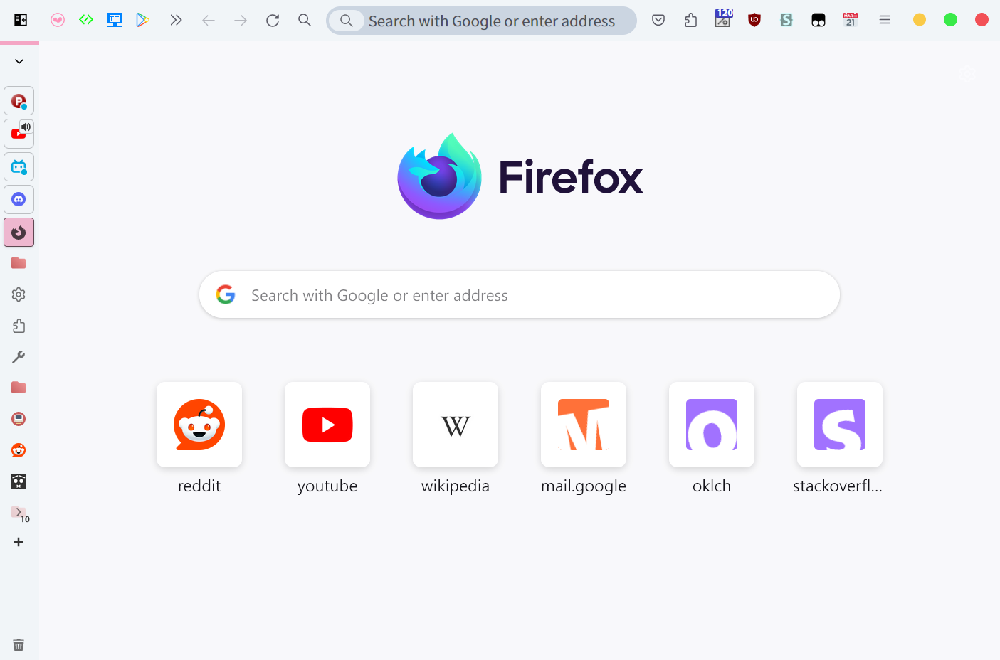
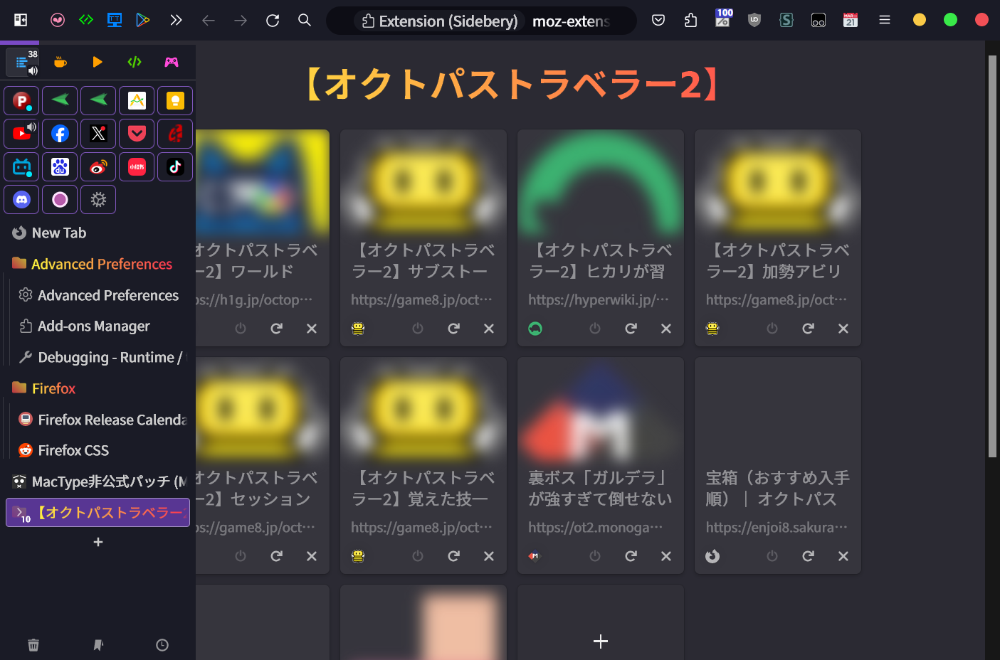

# FlexFox
A Firefox theme based on [VerticalFox](https://github.com/christorange/VerticalFox), offering enhanced flexibility options.

## Previews

## Features
- Based on [VerticalFox](https://github.com/christorange/VerticalFox), [EdgyArc-fr](https://github.com/artsyfriedchicken/EdgyArc-fr), [Edge-Frfox](https://github.com/bmFtZQ/edge-frfox), [ArcWTF](https://github.com/KiKaraage/ArcWTF), and [firefox-csshacks](https://github.com/MrOtherGuy/firefox-csshacks).

- Automatically collapses sidebar, tabs toolbar, and bookmarks toolbar; expands on hover.

- Options to completely hide sidebar, nav-bar, or both for a full-screen-like experience with only web content visible; auto-expands when mouse moves to screen edges.

- Hidden elements expand using an overlap method, preventing content shifting and visual jumps.

- Compatible with menu bar and title bar display; sidebar can be placed on the right side; styles automatically adjust to the chosen configuration.

- Sidebery's Pinned Tabs Bar and Navigation Bar auto-collapse and expand; when expanded, all tabs maintain their positions, eliminating need for mouse repositioning.

- Floating find bar at the top of the screen.

- Compact uni-extensions panel and macOS-style window controls.

## Installation
> [!IMPORTANT]
> 1. Enter `about:config` in the URL bar and set `toolkit.legacyUserProfileCustomizations.stylesheets` to "True" to enable custom styles.
> 2. Install [Sidebery](https://addons.mozilla.org/en-US/firefox/addon/sidebery/).
> 3. Click `<>Code` at the top of this page and select [`Download ZIP`](https://github.com/yuuqilin/FlexFox/archive/refs/heads/main.zip) to download the FlexFox package.
> 4. Enter `about:support` in the URL bar and click `Open folder` in the `Profile folder` section to access your profile directory.
> 5. Copy the `chrome` folder and `user.js` file from the `Profiles` folder in the FlexFox package to your `Profile folder`, then restart Firefox.
>    - After restarting, delete the `user.js` file you just copied to the `Profile folder`.
> 6. Click the gear icon to open Sidebery settings, select `Help`, then click `Import addon data`. Import `sidebery-settings.json` and `sidebery-styles.json` from the `Sidebery` folder in the FlexFox package.
>    - Sidebery settings may occasionally fail to import properly. If you notice that Sidebery's appearance hasn't changed or the style seems incorrect, please try importing the settings again.
> 7. In `about:config`, search for `uc.flex` and modify FlexFox options as needed.

## Options
<table>
  <tr>
    <th>Preference</th>
    <th>Description</th>
  </tr>
    <tr>
    <td><code>uc.flex.add-ui-text-stroke</code></td>
    <td>Bolds Firefox interface text</td>
  </tr>
  <tr>
    <td><code>uc.flex.bookmarks-have-more-margin-left</code></td>
    <td>Increases left margin of bookmarks when placed in nav-bar</td>
  </tr>
  <tr>
    <td><code>uc.flex.hide-sidebery-completely</code></td>
    <td>Fully hides Sidebery</td>
  </tr>
  <tr>
    <td><code>uc.flex.hide-toolbox-completely</code></td>
    <td>Fully hides tabs-toolbar and nav-bar</td>
  </tr>
  <tr>
    <td><code>uc.flex.large-sidebery</code></td>
    <td>Increases expanded Sidebery width</td>
  </tr>
    <tr>
    <td><code>uc.flex.prevent-bookmarks-auto-hide</code></td>
    <td>Disables auto-hiding of bookmarks toolbar</td>
  </tr>
  <tr>
    <td><code>uc.flex.prevent-tabs-toolbar-auto-hide</code></td>
    <td>Disables auto-hiding of tabs-toolbar when Sidebery is disabled</td>
  </tr>
  <tr>
    <td><code>uc.flex.remove-bookmarks-folder-icons</code></td>
    <td>Removes bookmark folder icons</td>
  </tr>
    <tr>
    <td><code>uc.flex.remove-bookmarks-labels</code></td>
    <td>Removes bookmark labels</td>
  </tr>
    <tr>
    <td><code>uc.flex.restore-uni-extensions-panel</code></td>
    <td>Disables compact uni-extensions panel, switching to condensed uni-extensions panel</td>
  </tr>
    <tr>
    <td><code>uc.flex.restore-window-controls</code></td>
    <td>Disables macOS-style window controls, reverting to default controls</td>
  </tr>
    <tr>
    <td><code>uc.flex.sidebery-hover-fast-expand</code></td>
    <td>Speeds up Sidebery's expand/collapse on hover</td>
  </tr>
    <tr>
    <td><code>uc.flex.sidebery-hover-slow-expand</code></td>
    <td>Slows down Sidebery's expand/collapse on hover</td>
  </tr>
</table>

## Known Issues
If you're using Firefox Nightly 129.0a1, please rename 'uc-urlbar-fix-for-129.0a1.css' to 'uc-urlbar.css' and replace the existing file. This will fix display issues with the URL bar.

This style has only been tested on Windows. Manual adjustments may be needed for other operating systems.
