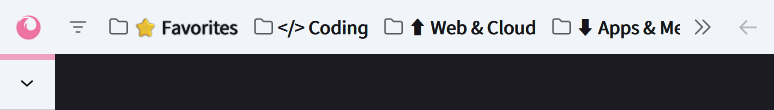
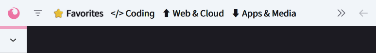
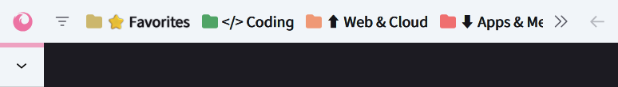
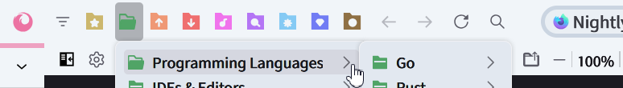

#  FlexFox（日本語版）

<div>
 <a href='https://www.mozilla.org'></a>
 <a href='https://github.com/yuuqilin/FlexFox/commits/main/'></a>
 <a href='https://github.com/yuuqilin/FlexFox/commits/Beta/'></a>
 <a href='https://github.com/yuuqilin/FlexFox/stargazers'></a>
</div>

<br>

FlexFox は Firefox をより快適で賢く、使いやすいブラウザに変えます。  
無駄な視覚要素を省き、安定した UI と軽快な動作を両立。  
カスタマイズ性の高いベースとして、理想のインターフェースを自由に作れます。  
見た目を変えるだけではなく、ブラウジングの質そのものを高めるテーマです。  

 

## 🆕 最新情報

**🦊 3.3.4**
- サイドバー・ボタンがナビゲーションバーの先頭または末尾以外にある場合、そのサイズが通常のツールバーボタンと同じ大きさに戻るようになりました。
- カラーブックマークフォルダーとのデザイン統一のため、「すべてのタブを表示」ボタンのアイコンを変更しました。`uc.flex.revert-to-original-sidebar-icon` を `true` に設定すると、元のFirefoxアイコンに戻せます。
- 数値型オプション `uc.flex.enable-colored-bookmarks-folder-icons` を追加しました：

  - `0`：無効
  - `1`：第1セットのカラーフォルダーアイコンを有効化
  - `2`：フォルダー名を自動的に非表示にし、第2セットのアイコンを使用

**表示例：**
こちらはFirefoxのデフォルトのブックマークフォルダーアイコンです：  


`uc.flex.remove-bookmarks-folder-icons` を有効にすると、フォルダーアイコンが非表示になり、フォルダー名のみが表示されます：  


`uc.flex.enable-colored-bookmarks-folder-icons` を `1` に設定すると、第1セットのカラーフォルダーアイコンが表示されます：  


さらに `uc.flex.remove-bookmarks-labels` を併用すると、ラベルが非表示になり、アイコンのみ表示されます：  


値を `2` に設定すると、ラベルが自動的に非表示になり、第2セットのアイコンが適用されます：  


- CSS変数 `--uc-bookmark-folder-*` を編集してアイコンの色・サイズ・位置を調整したり、`../icons/bookmark/` フォルダー内の `folder*.svg` ファイルを差し替えて好きなアイコンに変更することができます。

🚀 **新機能：ショートカットによる UI レイアウト切り替えに対応**

FlexFox は [UserChrome Toggle Extended](https://addons.mozilla.org/firefox/addon/userchrome-toggle-extended/) 拡張機能に対応しました。
以下の画像のように設定してください：  
  
設定後は、左上の `Apply changes` ボタンをクリックするのを忘れずに。クリックしないと設定が反映されません。

設定が完了すれば、次のショートカットキーで 4 種類の UI レイアウトを切り替えられます：

| ショートカット | ラベル | 動作内容 |
| ------------- | ------ | ------- |
| <kbd>Ctrl</kbd> + <kbd>Shift</kbd> + <kbd>1</kbd> | Lock Sidebery | Sidebery を自動折りたたみと常に展開の状態で切り替え。`uc.flex.disable-sidebery-autohide` オプションと同じレイアウト動作。 |
| <kbd>Ctrl</kbd> + <kbd>Shift</kbd> + <kbd>2</kbd> | Hide Topbar | タブ・ナビゲーションバー・ブックマークバーなど、すべての上部ツールバーを完全に非表示に切り替え。隠れている時はマウスを画面上端に移動すると表示されます。`uc.flex.fully-hide-toolbox` と同様。 |
| <kbd>Ctrl</kbd> + <kbd>Shift</kbd> + <kbd>3</kbd> | Hide Sidebery | Sidebery を完全に非表示に切り替え。隠れている時はマウスを画面端に移動すると表示されます。`uc.flex.fully-hide-sidebery` と同様。 |
| <kbd>Ctrl</kbd> + <kbd>Shift</kbd> + <kbd>4</kbd> | Hide All | すべてのツールバーと Sidebery を隠し、ウェブページのコンテンツだけが表示される状態に切り替え。隠れている時はマウスを画面端に移動すると表示されます。レイアウトは `uc.flex.fully-hide-toolbox` と `uc.flex.fully-hide-sidebery` と同様の動作をします。 |

> [!IMPORTANT]
> `about:config` で有効にしているオプションはショートカットより優先され、状態が固定されます。ショートカットで切り替えを行うには、該当するオプションを `false` に設定してください。

キーボードショートカットに加えて、UserChrome Toggle Extended 拡張機能のボタンからもレイアウトを切り替えることができます。  
  
ショートカットキーの設定を変更するには、右上の歯車アイコンをクリックし、メニューから **拡張機能のショートカットキーの管理** を選んでください。  


<a id="updates-top-start"></a>
<details>

<summary>💬 <b>過去の更新</b></summary>

**v3.3.3**
- ネイティブの縦型タブモードで角の丸みが正しく表示されない問題を修正しました。

**v3.3.2**
- ネイティブの横型タブモードで、ヘッダーストライプにグラデーションが表示されるようになりました。（ちなみに、`--uc-gradient-highlight` 変数を使えばグラデーションの色をカスタマイズできます。）
- 横型タブモードで、サイドバーボタンが右端にある場合にウィンドウ操作ボタンと重なってしまう問題を修正しました。
- ナビゲーションバーの2番目の要素がブックマークアイテムの場合、`uc.flex.disable-nav-bar-first-item-right-padding` が `false` に設定されていない限り、左側に常に余白が追加されるようになりました。
- Sideberyが非アクティブなとき、Firefox標準の縦型タブおよびコンテンツ領域の角丸が復元されます。角丸を無効にするには、**Firefox標準の**設定オプション `sidebar.revamp.round-content-area` を `false` に設定してください。
- メニューアイコンが誤った画像を表示していた問題を修正しました。

**v3.3.1**
- すべての上部バーと Sidebery を非表示にするショートカットを追加しました。

**v3.3.0**
- `expand-on-hover` を有効にしている状態で `uc.flex.fully-hide-sidebery` またはフルスクリーンを併用した際に、Sidebery が展開されなくなる問題を修正しました。
- サイドバー切り替えボタンが画面右端にあるときに、位置がずれる問題を修正しました。

**v3.2.8**
- `uc.flex.add-bookmarks-left-margin` オプションを削除しました。現在は、ネイティブの縦型タブや Sidebery 使用時に、ナビゲーションバーの最初のアイテムの後ろに自動で余白が追加されます。これにより縦タブとの視覚的な整列が自然になり、ツールバーの他の項目と適度に区切られます。このスペースは、全画面表示や縦タブが非表示のときには自動で無効になります。
- この挙動を無効化するオプション `uc.flex.disable-nav-bar-first-item-right-padding` を追加しました。
- サイドバー切り替えボタンのアイコンが FlexFox のロゴに置き換えられました。このロゴはナビゲーションバーの最左端に表示されるよう設計されていますが、Firefox の「ツールバーをカスタマイズ」機能を使って、任意の場所に移動できます。サイドバーが右側にある場合、Firefox は通常このアイコンをナビゲーションバーの右端に自動で移動しますが、FlexFox はさらに画面の最右端（ハンバーガーメニューやウィンドウ制御ボタンのさらに右）へ移動させ、右側の縦型タブと整列するようにしています。
- 上記の動作を無効にして、元のサイドバーアイコンに戻す `uc.flex.revert-to-original-sidebar-icon` オプションを追加しました。
- アドレスバーのブックマーク（星型）アイコンを Firefox の標準アイコンに戻す `uc.flex.revert-to-original-bookmark-star-icon` オプションを追加しました（FlexFox のデフォルトはハート型アイコン）。
- 実験的機能：`uc.flex.enable-gradient-highlight` オプションを追加。FlexFox ロゴ、サイドバーストライプ、ブックマークアイコンにグラデーション色を適用します。値は `0`（無効）または `1`（有効）を指定してください。現在は 1 種類のグラデーションのみ利用可能ですが、今後さらに多くの部位と色が追加される予定です。

**v3.2.7**  
- メニューのアイコン表示を無効にできる `uc.flex.disable-menu-icons` オプションを追加しました。  

**v3.2.6**
- アイコンのサイズを修正しました。

**v3.2.5**  
- 一部のメニューに欠けていたアイコンを追加しました。  

**v3.2.4**  
- サイドバー設定の **「カーソルを合わせた時にサイドバーを展開する」** を有効にすると、FlexFox のカスタム折りたたみ機能は無効化され、Firefox 標準の自動折りたたみ挙動が使用されるようになりました。この状態でも、Sidebery は <kbd>Ctrl</kbd>+<kbd>Alt</kbd>+<kbd>Z</kbd> のショートカットキーやサイドバーの切り替えボタンを使って、**自動折りたたみ**と**常に展開**の状態を切り替えることができます。  
- また、Sidebery が常に展開された状態のときに、マウスホバー時のアニメーションによって軽微な画面の揺れが発生することがあります。これを抑えるために、アニメーションを無効化するオプション `uc.flex.disable-sidebery-hover-animations` を追加しました。ただし、無効化すると折りたたみ時の見た目の整然さがやや損なわれる場合があります。  

**v3.2.3**  
- Firefoxの「ホバーでサイドバーを展開」モード（ネイティブの縦型タブ）における表示の不具合を引き続き修正しました。  

**v3.2.2**  
- Firefoxのネイティブ縦型タブにおける「ホバーで展開」モード使用時の表示崩れをいくつか修正しました。  

**v3.2.1**  
- ネイティブの垂直タブを展開した際、サイドバーに隠れてしまう不具合を修正しました。  

**v3.2.0**  
- サイドバー切り替えボタンのホバー時に背景が消える不具合を修正しました。  
- Firefox v138で追加されたネイティブの垂直タブ「カーソルを合わせた時にサイドバーを展開する」モードに完全対応。  
  この設定を有効にすると、FlexFoxの垂直タブ自動折りたたみ機能は無効化され、Firefox標準の動作が使われます。  
  このモードでは、垂直タブバーの幅を自由に調整できます。  

<a id="updates-top-3.1"></a>
<details>
<summary>📦 <b>v3.1.xの更新</b></summary>

**v3.1.9**  
- テーマ適用時にサイドバーの切り替えボタンが消える不具合を修正しました。  
- Sideberyの自動非表示を無効にした際、ブックマークツールバーとナビゲーションバーの位置が正しく調整されない問題を修正しました。 

**v3.1.8**  
- Nightly v140で、拡張パネルウィンドウでもサイドバーのヘッダーが表示されるようになったため、これを非表示にし、Sideberyなどのレイアウトを元に戻しました。  
- ナビゲーションバーと縦型タブの整列を調整しました。  

**v3.1.7**  
- Firefox標準の縦型タブを展開する際、アニメーションのタイミングがずれていた問題を修正しました。タブのラベル表示が幅の変化と同期するようになりました。  
- PowerShellインストーラーにおけるダウンロードファイルのサイズ推定値をより実際のサイズに近づけました。  

**v3.1.6**
- `content`フォルダに `uc-custom-content.css` を作成することで、ウェブページの表示に対する独自スタイルを適用できるようになりました。このファイルは `userContent.css` の末尾で読み込まれるため、前のスタイルを上書きできます。また、FlexFox本体には含まれていないため、今後のアップデートでも内容が上書きされることはありません。
- Gitクローン＋pullによる更新を行うユーザー向けに、プロジェクトのディレクトリ構成を整理しました。将来リリース予定のインストール・アップデートスクリプトにも対応しています。

**v3.1.5**  
- 新しいサイドバーが有効な場合に、不要なスタイルルールの適用を回避するようにしました。 
- クラシックサイドバーで、切り替えメニュー（スイッチャー）にカーソルを合わせた際にサイドバーが折りたたまれてしまう、長年の不具合を修正しました。  
_補足：このバグは長らく存在していましたが、影響が軽微で、修正にはわずかな性能コストが伴うため、これまで放置されていました。FlexFox が新しいサイドバーに完全移行した今、旧バージョンに区切りをつける形で修正を行いました。_

**v3.1.4**  
- Findbarの表示位置を微調整しました。

**v3.1.3**  
- Findbarを右下に配置した際に、一致件数が表示されない問題を修正しました。

**v3.1.2**

- Findbar（検索バー）のデフォルト位置が、*上部中央やや左寄り*から*右上*に変更されました。文字列型の新しい設定オプション `uc.flex.findbar-position` が追加されています：
  - `"top-center-left"` または `"0"` を指定すると、以前のデフォルトである上部中央左寄りに表示されます。
  - `"top-right"` または `"1"` を指定すると、現在のデフォルトである右上に表示されます。
  - `"bottom-right"` または `"2"` を指定すると、Firefox本来の下部右側に表示されます。
- `--uc-findbar-top` 変数は廃止されました。代わりに `--uc-findbar-x-position` と `--uc-findbar-y-position` により、任意の位置への調整が可能になりました。
- サイドバーの最小幅に関するハードコードを撤廃し、`--uc-sidebar-width` 変数によって最小幅を自由に設定できるようになりました。

**v3.1.1**

- Sideberyの折りたたみ・展開アニメーションのデフォルトを`ease-in-out`に変更し、Firefoxのネイティブ縦型タブと動作を統一しました（以前はSideberyが`linear`を使用していました）。アニメーションの種類は`uc-user-settings.css`内の`--uc-autohide-transition-type`変数でカスタマイズ可能です。
- Firefox標準の縦型タブのアニメーションも`--uc-autohide-transition-type`によって変更可能になりました。
- 新しいサイドバーを有効にしていてウィンドウが最大化されていない状態で、`uc.flex.fully-hide-sidebery`オプションを使うと、ウィンドウ端に余白が発生し、Sideberyの高さが正しく表示されない問題を修正しました。

今回のアップデートにより、旧バージョンの水平タブモードで利用可能だった全機能が縦型タブモードでも完全に利用可能となりました。FlexFox v3.1.1で、よりスムーズな移行が可能になります。

**v3.1.0**
- `uc-variables.css`の構成を見直し。ユーザーがよく使うカスタマイズ可能な変数をファイルの先頭にまとめ、分かりやすい説明を追加しました。
- FlexFoxによるツールバー背景色の上書き処理を全面的に再設計。テーマ適用時に発生していた背景画像のずれ、透明度の不具合、非アクティブウィンドウ時の表示崩れなどがすべて解消されたはずです。
- 垂直タブの折りたたみ／展開時のアニメーションがよりスムーズになりました。
- ナビゲーションバーの位置を微調整し、垂直タブとの整合性を改善しました。
- `uc.flex.allow-addons-to-change-toolbar-color`を切り替えても、サイドバーが上下にずれることがなくなりました。

<a href="#updates-top-3.1">🔝 セクションの先頭へ戻る</a>
</details>

<a id="updates-top-3.0"></a>
<details>
<summary>📦 <b>v3.0.xの更新</b></summary>

**v3.0.7**
- Firefoxのネイティブタブ（横型・縦型の両方）を使用している場合に、アクティブなタブの背景ハイライトが正しく表示されない問題を修正しました。  
- メニューバーを表示し、ブックマークバーを自動的に隠す設定にしていると、テーマの背景画像がナビゲーションバーとブックマークバーの間でずれて表示される問題を修正しました。  
- Firefoxウィンドウが非アクティブ状態のときに、メニューバーの背景色が正しく切り替わらない問題を修正しました。

**3.0.6**
- インポートしている複数のスタイルを最新版に更新。  
  - 検索バーがフォーカスを失ったときの閉じるアニメーションを追加。  
  - パネルが開いている際にナビゲーションバーが非表示にならないよう挙動を改善。  
- 潜在的な不具合やデバッグの困難を避けるため、非標準の構文を修正しました。

**v3.0.5**  
- `uc.flex.allow-addons-to-change-toolbar-color` を有効にした際に発生する、サイドバーストライプの位置ずれを修正しました。

**v3.0.4**  
- タイプミスを修正しました。  
- 新しいサイドバーのオプション `タブとサイドバーを隠す` を有効にした際に、ブックマークツールバーの水平方向のずれを修正しました。

**v3.0.3**  
- `uc.flex.fully-hide-sidebery` が有効、または全画面モードの際に、サイドバーストライプが展開できない問題を修正しました。併せて、同条件下で発生していたサイドバーストライプと Sidebery のアニメーションの同期ズレも修正しています。  
- メニューバーの背景色がナビゲーションツールバーと一致しないテーマの表示不具合を修正しました。

**v3.0.2**  
- サイドバーが右側にある場合の展開・折りたたみアニメーションの不具合を修正しました。  
- ネイティブの縦型タブもSideberyと同じ展開／折りたたみ速度になりました。`uc.flex.sidebery-fast-hover-expand` または `uc.flex.sidebery-slow-hover-expand` オプションで速度を調整できます。または `--uc-autohide-*` および `--uc-hover-*` の変数を直接編集して、お好みの速度に変更することもできます。

**v3.0.1**  
- `uc.flex.disable-bookmarks-autohide` を使用中に、新しいサイドバーのサイドバーストライプの位置がずれる問題を修正しました。  
- `uc.flex.disable-sidebery-autohide` を使用中に、サイドバーストライプの幅が不正になる問題を修正しました。

**v3.0.0**
- Firefoxのネイティブ縦型タブとSideberyを統合しました。  
  - Sideberyが有効な場合、ネイティブの縦型タブは自動的に非表示になり、新しいサイドバーはSidebery上部の細いカラーストライプ（サイドバーストライプ）に折りたたまれます。サイドバーストライプにマウスカーソルを合わせると、サイドバーのツールボタンが表示されます。  
  - Sideberyが無効な場合（たとえば別のサイドバーツールや拡張機能を開いたとき）は、代わりにネイティブの縦型タブが表示されます。  
  - F1キーでSideberyを素早く切り替えると、Sideberyとネイティブの縦型タブは同じ幅とレイアウトを共有しているため、シームレスに切り替わるように見えます。  
  - サイドバーが左側・右側のどちらに配置されていても、自動でレイアウトが調整され、UIに適応します。  
- 数値オプション `uc.flex.max-visible-vertical-pinned-tabs` を新たに追加しました（設定可能範囲：4～6）。このオプションは、ネイティブの縦型タブパネルの各列に縦方向で表示できるピン留めタブの数を制御します。初期値は4です。縦に並ぶピン留めタブの数がこの値を超えると、スクロールバーが表示されます。

> [!IMPORTANT]
> ネイティブの縦型タブが自動的に折りたたまれ、ホバーで展開されます。`サイドバーを展開します`ボタン（Alt+Ctrl+Z）でこの機能を有効にできます。 
> <details>
> <summary>🖼️ <b>ネイティブ垂直タブの自動折りたたみのデモ</b></summary>
> <p><code>uc.flex.show-pin-tabs-separator-in-expanded-state</code> が false の状態でネイティブ垂直タブを展開した例</p>
> 
> <p><code>uc.flex.show-pin-tabs-separator-in-expanded-state</code> が false の状態でネイティブ垂直タブを折りたたんだ例</p>
> 
> </details> 

> [!TIP]
> **ユーザーは現在、`components` フォルダー内に `uc-user-settings.css` ファイルを作成することで、FlexFox のスタイルをカスタマイズできます。このファイルは FlexFox の後に読み込まれ、そのスタイルを上書きするため、将来的なアップデート後もカスタム変更が保持されます。**  
> **詳細は次のセクションをご覧ください: [User-Customizable Styles (`uc-user-settings.css`)](https://github.com/yuuqilin/FlexFox?tab=readme-ov-file#-user-customizable-styles-uc-user-settingscss)**

<a href="#updates-top-3.0">🔝 セクションの先頭へ戻る</a>
</details>

<a id="updates-top-2.0"></a>
<details>
<summary>📦 <b>v2.x.xの更新</b></summary>

**v2.1.2**  
- ネイティブの縦型タブと `uc.flex.disable-bookmarks-autohide` が両方有効な場合に、ブックマークバーがずれる問題を修正しました。  
- フルスクリーン時にURLバーの遷移が遅れる問題を修正しました。  

**v2.1.1**  
- Firefox v137でネイティブ縦型タブの背景が透過になる問題を修正しました。  
- `uc.flex.disable-native-vertical-tabs-autohide` オプションを追加しました。trueに設定するとネイティブ縦型タブの自動折りたたみを無効化できます。  

**v2.1.0**  
- ネイティブの縦型タブが自動的に折りたたまれ、ホバーで展開されます。`サイドバーを展開します`ボタン（Alt+Ctrl+Z）でこの機能を有効にできます。  
- 新しいオプション `uc.flex.show-pin-tabs-separator-in-expanded-state` を追加し、ネイティブの垂直タブ使用時にピン留めタブのパネルに区切り線を表示できるようになりました。  
- ネイティブの縦型タブを有効にした際にテーマが適用されない不具合と、ブックマークバーを自動的に非表示にした時に背景画像が崩れる問題を修正。  
- **`components` フォルダに `uc-user-settings.css` を作成することで、FlexFox のスタイルをユーザーが自由に上書きできるようになりました。このファイルは FlexFox より後に読み込まれるため、FlexFox を更新しても設定が上書きされることはありません。**  
- ネイティブの縦型タブとSideberyの統合はまだ未対応で、同時には使用できません。  

サイドバーのツールボタンのデザインは、@Godiesc 氏の [firefox-gx](https://github.com/Godiesc/firefox-gx) を参考にしています。優れた実装に感謝します。  

**v2.0.3**  
- Firefox v138+との互換性を確保するために、`sidebar-positionend`属性を追加し、新しいサイドバーの幅を少し調整しました。  

**v2.0.2**  
- `@media` ルールを Firefox v137+ に対応するよう更新。  

**v2.0.1**  
- ウィンドウが最大化されていない時、上部に1pxの枠線を追加しました。  
- スタイルを整理し、不要なルールやコメントを削除しました。  

**v2.0.0**:  
- コア機能を完全に再設計し、旧バージョンと比べ速度が28倍向上しました。  
   - 起動後、初回の右クリックメニューの表示時間は13msで、Firefoxのネイティブテーマと全く同じ速度です。  
   - タブが205個ある状態で「すべてのタブを一覧表示」を開く時間も26msで、こちらもネイティブテーマと同等です。  
   - つまり、再設計により、v2.0.0がFirefoxのパフォーマンスに与える影響はほぼ皆無と言えます。  
- Nightly (v135)のアドレスバーとネイティブ縦型タブの表示問題を修正しました。  

<details>
<summary>🖼️ <b>新機能の使用例</b></summary>
<p>ダークテーマで<code>uc.flex.disable-sidebery-autohide</code>を有効化したFlexFox：</p>

<p><code>uc.flex.fully-hide-toolbox</code>と組み合わせた表示：</p>

</details>

<a href="#updates-top-2.0">🔝 セクションの先頭へ戻る</a>
</details>

<a id="updates-top-1.0"></a>
<details>
<summary>📦 <b>v1.x.xの更新</b></summary>

**v1.1.1**:
- テーマ適用時に検索バーの背景色が正しく表示されない問題を修正しました。

**v1.1.0**:
- テーマ背景が有効で、ブックマークツールバーの自動非表示を使用する際に、ホバーで背景画像が途切れる問題を修正しました。
- ズームレベルのテキストの明るさを調整しました。
- Nightly (v135) におけるウィンドウコントロールの位置の問題を修正しました。`tabsintitlebar` 廃止後の `customtitlebar` との互換性を対応済み。
- Sideberyの自動折りたたみを無効化するオプション`uc.flex.disable-sidebery-autohide`を追加しました。

> [!IMPORTANT]
> v1.1.0版の`sidebery-styles.json`をインポートする前に、旧バージョンのスタイルを削除してください。Sideberyの設定（歯車アイコン）> `Styles editor` > `Sidebar` と `Group page` の両セクションでスタイルをすべてクリアしてから、新しいスタイルをインポートしてください。  
> また、`sidebery-settings.json` をインポートすると、パネルデータが失われる場合がありますので、必ず事前にスナップショットでバックアップを作成してください。

**v1.0.4**:
- ウェブページのズームレベルがデフォルトでない場合、ズームレベルアイコンを常に表示するようにしました。
- ウェブページがブックマーク済みの場合、ブックマークの星アイコンを常に表示するようにしました。  
     
   

**v1.0.3**:
- `uc.flex.allow-addons-to-change-toolbar-color` オプション有効時のパフォーマンスを最適化し、v1.0.2と比較して速度が1.4倍向上しました。

**v1.0.2**:
- URLバーのスイッチャーとチックレットの表示を改善。
- テーマや拡張機能がツールバー背景を変更可能にするオプション `uc.flex.allow-addons-to-change-toolbar-color` を追加。  
   

**v1.0.1**:  
- URLバーのトラッキング保護アイコンが非表示にならない問題を修正しました。 
- `uc-pdf.js.css` を追加しました。 
- LICENSEファイルを追加しました。

**v1.0.0**:
- パフォーマンスが劇的に向上し、従来版と比べて約100倍の高速化を実現しました。コンテキストメニューの表示にかかる時間は標準UIと比べてわずか**16ms**の差に抑えられています。

> [!IMPORTANT]
> Firefox v133より前のバージョンでFlexFoxをお使いの方は、アップデート前に`about:config`で`uc.flex.`を検索し、該当する設定をすべて削除してください。

<a href="#updates-top-1.0">🔝 セクションの先頭へ戻る</a>
</details>

<a href="#updates-top-start">⏫ アップデート一覧の先頭へ戻る</a>
</details>

## ✨ 特徴

### 🌟 ミニマル設計

> *表示領域を最大限に。*

- ツールバーやサイドバーを個別に折りたたみ・非表示にできます。  
  > *サイドバーだけを隠してナビゲーションバーを残す、あるいはその逆など、柔軟に組み合わせて作業しやすい画面にできます。*

- すべてのUIを隠すことで、コンテンツに完全フォーカス。  
  > *ブラウザのUIが一切ない、まるで付箋のような小さなウィンドウを作ることができ、複数ページの並列表示や作業用のコンパクトビューにも最適です。また、全画面表示に切り替えることなくページ領域を最大化でき、デスクトップ環境へのアクセスも維持されます。*

### 🌟 安定した動作

> *UIが動いても、ページは動かない。*

- UIを展開しても、ページのレイアウトに影響なし。  
  > *折りたたまれたUIはページ上に浮かぶように表示され、表示中のページが押しのけられることはありません。*

- タブを展開しても位置がずれません。  
  > *縦型タブが展開される際、横に広がっても元の縦位置のまま動かず、マウスカーソルの再移動は不要です。*

### 🌟 適応性

> *使い方に合わせて自動調整。*

- Sidebery有効時はネイティブのタブバーを自動的に非表示に。  
  > *似た機能が重複しないように、自動的に最適化します。*

- Firefoxの様々なUI構成に対応。  
  > *タイトルバーやメニューバーの表示、ブックマークツールバーの有無、サイドバーの左右配置など、ユーザーの好みに合わせた環境でもレイアウトが崩れません。*

### 🌟 柔軟性

> *自分好みにカスタマイズ。*

- `about:config`から機能を簡単にオン・オフ可能。  
  > *不要な機能を無効にして、Firefox本来の見た目や挙動に戻すこともできます。*

- 独自スタイルで詳細設定も可能。  
  > *ユーザースタイルはFlexFox本体の後に読み込まれるため、設定を安全に上書きでき、アップデートの影響も受けません。*

## 💿 導入

### 🚀 方法1：自動インストールと更新

初めて FlexFox をインストールする場合は、スクリプトの実行後に [方法2](https://github.com/yuuqilin/FlexFox?tab=readme-ov-file#-method-2-manual-installation) の手順5以降を手動で実行してください。  
以降のアップデートでは、スクリプトを再実行するだけで自動的に更新されます。手動作業は不要です。

<details>
<summary><h4>💻 PowerShellスクリプト《クリックで展開》👇</h4></summary>

- **オンライン導入** – PowerShellで次のコマンドを実行します：
  ```powershell
   Set-ExecutionPolicy -Scope Process -ExecutionPolicy Bypass; iex ((New-Object Net.WebClient).DownloadString('https://raw.githubusercontent.com/yuuqilin/FlexFox/refs/heads/main/deploy-userchrome.ps1') -replace '(?s)<#.*?#>', '')
  ```
  **サイレント導入（オンライン）**：
  ```powershell
   $env:FLEXFOX_INSTALL_MODE = 'silent'; Set-ExecutionPolicy -Scope Process -ExecutionPolicy Bypass; iex ((New-Object Net.WebClient).DownloadString('https://raw.githubusercontent.com/yuuqilin/FlexFox/refs/heads/main/deploy-userchrome.ps1') -replace '(?s)<#.*?#>', '')
  ```

- **ローカル導入** – [`deploy-userchrome.ps1`](https://github.com/yuuqilin/FlexFox/raw/refs/heads/main/deploy-userchrome.ps1) をダウンロードしてPowerShellで実行：
  ```powershell
   Set-ExecutionPolicy -Scope Process -ExecutionPolicy Bypass; .\deploy-userchrome.ps1
  ```
  **サイレント導入（ローカル）**：
  ```powershell
   $env:FLEXFOX_INSTALL_MODE = 'silent'; Set-ExecutionPolicy -Scope Process -ExecutionPolicy Bypass; .\deploy-userchrome.ps1
  ```

- **タスクスケジューラや「ファイル名を指定して実行」からの導入**：
  ```powershell
   powershell -ExecutionPolicy Bypass -Command "$env:FLEXFOX_INSTALL_MODE = 'silent'; .\deploy-userchrome.ps1"
  ```

</details>

<details>
<summary><h4>🔃 Git Pull《クリックで展開》👇</h4></summary>

- 使用環境に応じて、`scripts` フォルダ内のいずれかの `git-pull-chrome-only` スクリプトを使ってください。これらのスクリプトでは：
  - FirefoxプロファイルフォルダをGitワーキングディレクトリとして設定
  - FlexFoxリポジトリをリモートとして登録
  - `chrome`フォルダのみを取得・更新（他のファイルは除外）

- または、手動でリモートリポジトリを追加：

  **初回セットアップ（chromeフォルダの作成）：**
  ```bash
  git init
  git remote add origin https://github.com/yuuqilin/FlexFox.git
  git sparse-checkout init --no-cone
  git sparse-checkout set /chrome
  git fetch origin
  git checkout -b main origin/main
  ```

  **手動で更新する場合：**
  ```bash
  git fetch origin
  git checkout main
  git merge origin/main --allow-unrelated-histories
  ```

</details>

---

### 👷 方法2：手動インストール

> [!IMPORTANT]
> 1. [Sidebery](https://addons.mozilla.org/firefox/addon/sidebery/) をインストール（推奨）。
> 2. FlexFoxをダウンロード：
>    - [FlexFox](https://github.com/yuuqilin/FlexFox/archive/refs/heads/main.zip)：通常版Firefox用
>    - [FlexFox Beta](https://github.com/yuuqilin/FlexFox/archive/refs/heads/Beta.zip)：Firefox Beta / Nightly用
>    - [FlexFox ESR](https://github.com/yuuqilin/FlexFox/archive/refs/heads/ESR.zip)：Firefox ESR用
> 3. `about:support`を開き、「プロファイルフォルダー」の「フォルダーを開く」をクリック。
> 4. `chrome` フォルダと、`scripts` フォルダ内の `user.js` をプロファイルフォルダにコピーします。
> 5. *(任意)* テキストエディタで`user.js`を編集し、必要な機能の`//`コメントを外す。
>    - 以下の設定は`true`のままにしてください：
>      - `toolkit.legacyUserProfileCustomizations.stylesheets`
>      - `svg.context-properties.content.enabled`
> 6. Firefoxを再起動し、その後`user.js`を削除して、`about:config`の変更を保存できるようにします。
> 7. Sideberyの設定：
>    - サイドバーの歯車アイコンから設定を開く
>    - 「ヘルプ」→「アドオンデータをインポート」で、アーカイブ内の`sidebery-settings.json`と`sidebery-styles.json`をインポート
>    - *注*：設定が反映されない場合は再度インポートしてください。
> 8. *(任意)* `about:config`で`uc.flex.`を検索し、必要に応じてFlexFoxの機能を有効／無効にします。

## ⚙️ カスタマイズ設定

### 📜 ユーザー定義スタイル（`uc-user-settings.css`、`uc-custom-content.css`）

> [!TIP]  
> FlexFox のコアファイルを直接編集せずに、Firefoxのインターフェースやウェブページの表示スタイルを自由にカスタマイズできます。
>
> カスタマイズの方法：
>
> - **Firefoxのインターフェース（chrome）**を変更するには、`components` フォルダに `uc-user-settings.css` を作成してください。
> - **ウェブページの内容（content）**を変更するには、`content` フォルダに `uc-custom-content.css` を作成してください。
>
> 必要に応じて、`uc-variables.css` などの既存ファイルから変数やスタイルをコピーし、自分用に編集して使うことができます。これらのファイルは **既定のスタイルの後に読み込まれるため、ユーザーの設定が優先されます。**
>
> これらのファイルは **FlexFox本体には含まれていないため、将来のアップデートで上書きされることはありません。** 一度設定すれば、以後もそのまま利用可能です。
>
> 💡 `:root` や `:root:has(...)` のようにセレクター内で定義されているルールをコピーする場合は、文脈を保つためにセレクター全体を含めてコピーしてください。

### 🧩 カスタマイズ可能な設定 (`about:config`)

#### 🪄 機能を追加・有効化するオプション

| 設定名 | 説明 |
|--------|------|
| `uc.flex.add-ui-text-stroke` | UIテキストに太めのアウトラインを追加し、特に低解像度の画面での視認性を向上させます。 |
| `uc.flex.fully-hide-sidebery` | Sidebery を完全に非表示にします。マウスカーソルを画面端に移動すると再表示されます。 |
| `uc.flex.fully-hide-toolbox` | 上部のすべてのツールバー（水平タブバー、ナビゲーションバー、ブックマークツールバー）を完全に非表示にします。マウスカーソルを画面上端に移動すると再表示されます。 |
| `uc.flex.allow-addons-to-change-toolbar-color` | テーマや拡張機能によるツールバーの背景色や背景画像の上書きを許可します。 |
| `uc.flex.enable-gradient-highlight` | FlexFox のロゴ、サイドバーのストライプ、ブックマークの星アイコンなど、主要な UI 要素に使われるハイライトカラーにグラデーションスタイルを適用します。数値で設定でき、`0` は無効、`1` ～ `X` は異なるグラデーションスタイルを選択します。 |
| `uc.flex.enable-colored-bookmarks-folder-icons` | ブックマークフォルダーのアイコンをカラー表示にします。数値で設定でき、`0` は無効、`1` は第1セットのアイコンを使用、`2` は第2セットのアイコンを使用し、ラベルは自動的に非表示になります。 |
| `uc.flex.remove-bookmarks-folder-icons` | ブックマークフォルダーのアイコンを非表示にします。 |
| `uc.flex.remove-bookmarks-labels` | ブックマークフォルダーのラベル（テキスト）を非表示にします。 |
| `uc.flex.show-pin-tabs-separator-in-expanded-state` | Firefox の「展開モード」のネイティブ垂直タブにおいて、ピン留めタブと通常タブの間に区切り線を表示します（デフォルトでは非表示）。 |

#### 🚫 機能を無効化・元に戻すオプション

| 設定名 | 説明 |
|--------|------|
| `uc.flex.disable-bookmarks-autohide` | ブックマークツールバーの自動非表示を無効にします。 |
| `uc.flex.disable-tabs-toolbar-autohide` | Sidebery が非アクティブなときに、ネイティブの水平タブバーが自動で隠れないようにします。 |
| `uc.flex.disable-findbar-autohide` | 検索バー（Findbar）のフォーカスが外れたときに自動で隠れる動作を無効にします。 |
| `uc.flex.disable-native-vertical-tabs-autohide` | Firefox の垂直タブバーの自動折りたたみを無効にします。 |
| `sidebar.visibility`（`always-show`） | Firefoxのネイティブ設定です。値を `always-show` にすると、Firefox標準の垂直タブバーの自動折りたたみが無効化され、代わりにFlexFox独自の自動折りたたみ機能が有効になります。FlexFoxはアニメーションの滑らかさ、折りたたみ時の整理されたレイアウト、ピン留めタブの扱いやすさに優れています。この設定は、サイドバーの設定画面で **「カーソルを合わせた時にサイドバーを展開する」** のチェックを外すことで切り替えることも可能です。 |
| `sidebar.visibility`（`expand-on-hover`） | 値を `expand-on-hover` にすると、Firefoxの垂直タブバーのネイティブな自動折りたたみ動作が有効になり、FlexFoxの機能は無効化されます。この動作は、サイドバー設定の **「カーソルを合わせた時にサイドバーを展開する」** を有効にすることで切り替え可能です。このモードでは、ネイティブの垂直タブとSideberyのどちらも、<kbd>Ctrl</kbd>+<kbd>Alt</kbd>+<kbd>Z</kbd>キーやサイドバーの切り替えボタンで展開・折りたたみの状態を変更できます。 |
| `sidebar.animation.expand-on-hover.duration-ms` | `sidebar.visibility` が `expand-on-hover` に設定されているときに、垂直サイドバーの展開・折りたたみにかかるアニメーションの速度を制御するFirefoxのネイティブ設定です。 |
| `uc.flex.disable-sidebery-hover-animations` | `sidebar.visibility` が `expand-on-hover` に設定され、Sidebery が「常に展開」状態になっている場合、ホバー時のアニメーションによって画面がわずかに揺れることがあります。この設定を有効にすると、そうしたアニメーションが無効化され、より安定した表示になりますが、折りたたみ時のレイアウトがやや崩れることがあります。 |
| `uc.flex.disable-sidebery-autohide` | Sidebery の自動折りたたみを無効にします。 |
| `uc.flex.disable-nav-bar-first-item-right-padding` | デフォルトでは、ナビゲーションバーの最初の項目の後ろに右側の余白を追加して、垂直タブとその周辺項目との視覚的な区切りや整列を改善します。このオプションはその余白を無効にします。 |
| `uc.flex.disable-menu-icons` | FlexFox によって追加されたメニューのカスタムアイコンを無効にします。 |
| `uc.flex.revert-to-original-window-controls` | FlexFox 独自の macOS風ウィンドウコントロールアイコンを Firefox 標準の最小化・最大化・閉じるボタンに戻します。 |
| `uc.flex.revert-to-original-bookmark-star-icon` | FlexFox 独自のブックマーク星アイコンを Firefox 標準のデザインに戻します。 |
| `uc.flex.revert-to-original-sidebar-icon` | FlexFox 独自のロゴを使用したサイドバーアイコンを Firefox 標準のデザインに戻します。 |

#### 🪛 機能を調整・変更するオプション

| 設定名 | 説明 |
|--------|------|
| `uc.flex.increase-sidebery-expanded-width` | Sidebery の展開時の幅を広げます。 |
| `uc.flex.switch-to-alternate-condensed-panel` | デフォルトでは、FlexFox は Firefox 標準の統合拡張機能パネルをアイコンのみのビューに置き換えます。この状態では、拡張機能アイコンを右クリックすることでオプションにアクセスできます。この設定を有効にすると、拡張名やオプションボタンも表示される簡易ビューに切り替わり、より情報が分かりやすくなります。 |
| `uc.flex.sidebery-fast-hover-expand` | Sidebery とネイティブ垂直タブの自動展開・折りたたみの動作を高速化します。 |
| `uc.flex.sidebery-slow-hover-expand` | Sidebery とネイティブ垂直タブの自動展開・折りたたみの動作を低速化します。 |
| `uc.flex.max-visible-vertical-pinned-tabs` | ネイティブの垂直タブにおいて、1列あたりに表示できるピン留めタブの最大数を設定します（数値の範囲は 4～6）。この数を超えるとスクロールバーが表示されるため、使用環境に応じて調整してください。 |
| `uc.flex.findbar-position` | 検索バー（Findbar）の表示位置を設定します。指定可能な値は文字列 `"top-center-left"` または `"0"`（左寄せ上部）、`"top-right"` または `"1"`（右上）、`"bottom-right"` または `"2"`（右下）です。 |

## 🐞 既知の問題

- **Floorp使用時の注意点：**  
  Floorpのインターフェース設定で`Firefox Proton UI`を選択すると、互換性の問題が軽減されます。

- **動作環境について：**  
  Windows環境での動作確認を行っています。他のOSでは別途調整が必要な場合があります。

## 🎖️ クレジット

FlexFox は、以下の優れたプロジェクトの成果を基盤に構築されています：

- **[VerticalFox](https://github.com/christorange/VerticalFox)** — 垂直タブのレイアウトと、いくつかのレイアウト設計の基本となる発想を提供してくれました。  
- **[firefox-csshacks](https://github.com/MrOtherGuy/firefox-csshacks)** — 多くの微調整やレイアウトの修正において、この素晴らしい CSS コレクションを活用しています。

また、以下のプロジェクトからもデザインや機能の着想を得ています：

- [EdgyArc-fr](https://github.com/artsyfriedchicken/EdgyArc-fr)  
- [Edge-Frfox](https://github.com/bmFtZQ/edge-frfox)  
- [ArcWTF](https://github.com/KiKaraage/ArcWTF)  
- [shimmer](https://github.com/nuclearcodecat/shimmer)
- [firefox-gx](https://github.com/Godiesc/firefox-gx)

これらの素晴らしい制作者の皆様に、心から感謝いたします。

<details>
  <summary><h2 style="display: inline;">📄 ライセンス</h2></summary>
  <hr style="border: none; border-top: 1px solid #d0d7de; margin: 16px 0;">
  <p>本プロジェクトは主に MIT ライセンスのもとで公開されています。<br>
  ただし、一部のソースコード（以下参照）は Mozilla Public License 2.0（MPL-2.0）でライセンスされたコードを組み込んでいます。</p>

  <p>具体的には、<code>uc-sidebar.css</code> 内の一部コードは、以下のプロジェクトに由来しています：</p>

  <ul>
    <li><strong>プロジェクト</strong>：firefox-gx</li>
    <li><strong>作者</strong>：@Godiesc</li>
    <li><strong>リポジトリ</strong>：<a href="https://github.com/Godiesc/firefox-gx">https://github.com/Godiesc/firefox-gx</a></li>
    <li><strong>ライセンス</strong>：MPL-2.0</li>
  </ul>

  <p>該当するコードには元の MPL-2.0 のライセンス表記が保持されており、ライセンス条件を遵守しています。<br>
  MPL-2.0 の全文は <code>LICENSES/MPL-2.0.txt</code> をご覧ください。</p>
</details>
