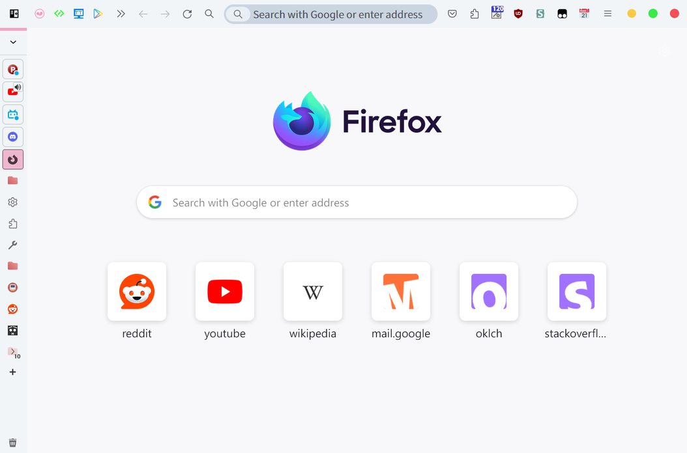
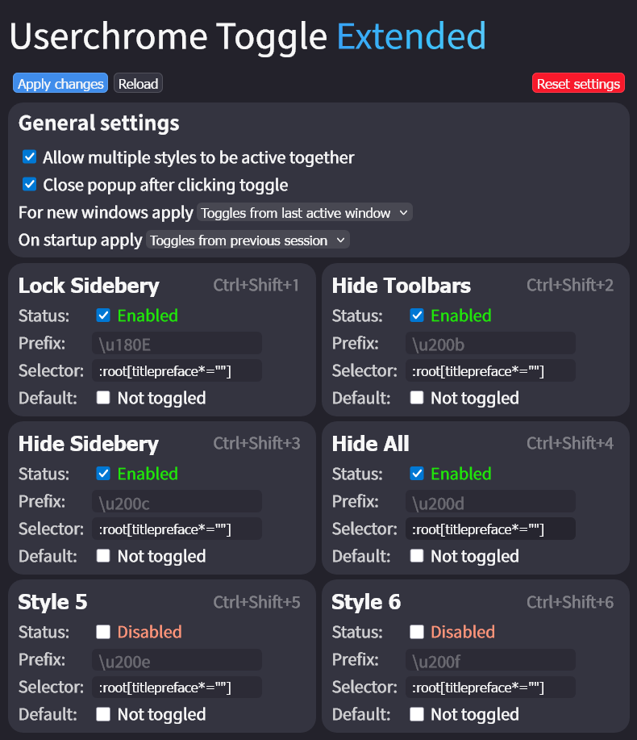
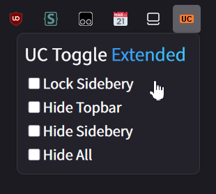
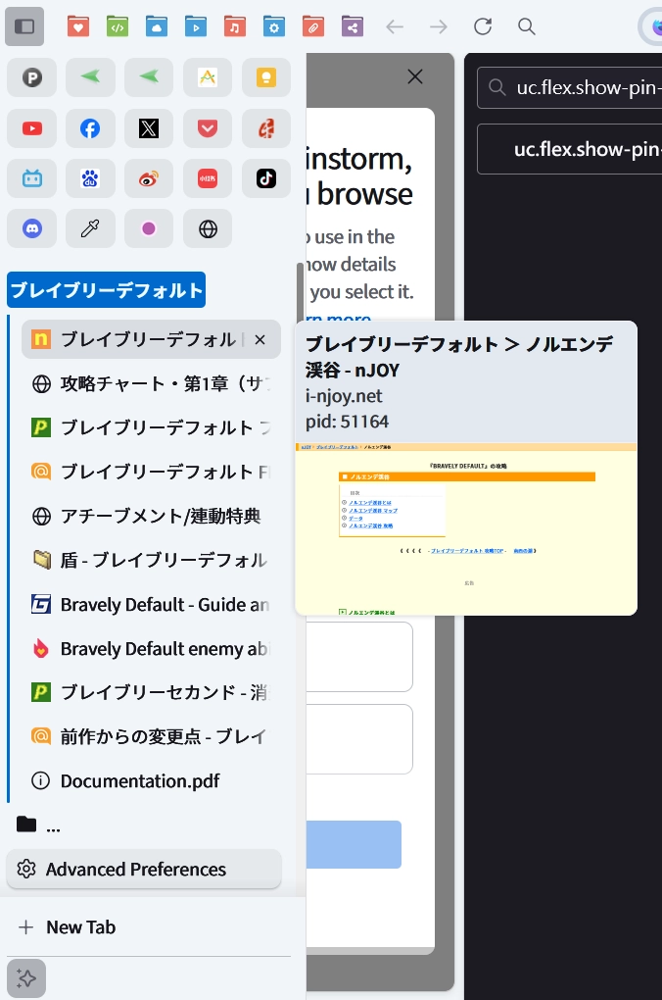
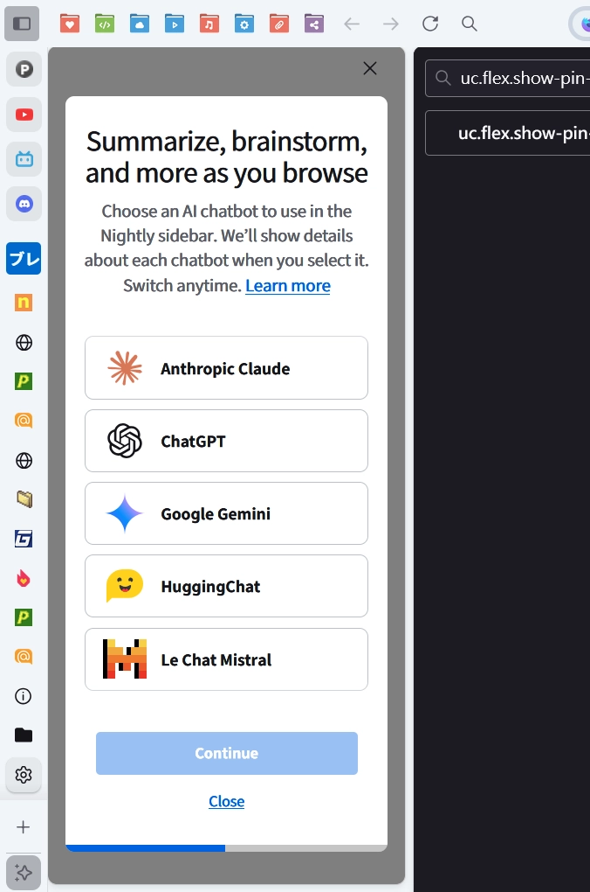
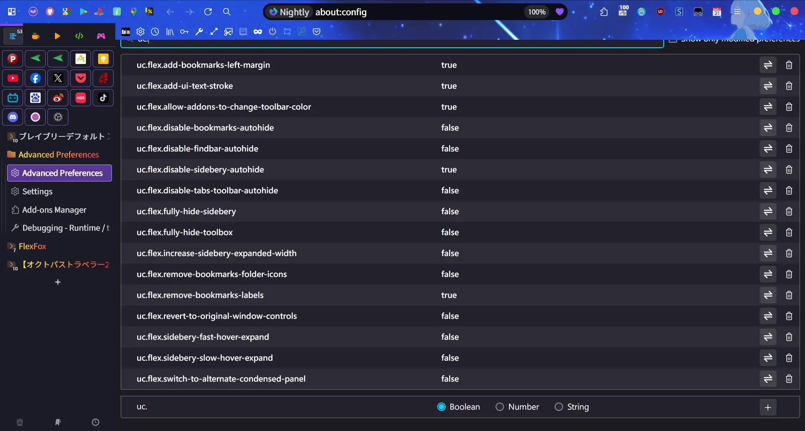
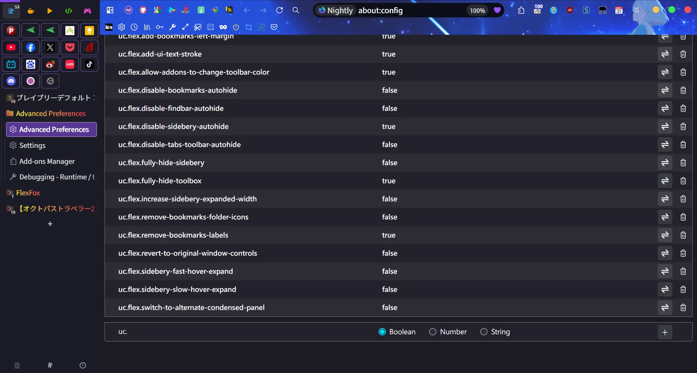

#  FlexFox（简体中文版）

<div>
 <a href='https://www.mozilla.org'></a>
 <a href='https://github.com/yuuqilin/FlexFox/commits/main/'></a>
 <a href='https://github.com/yuuqilin/FlexFox/commits/Beta/'></a>
 <a href='https://github.com/yuuqilin/FlexFox/stargazers'></a>
</div>

<br>

FlexFox 让 Firefox 变得更快、更智能，也更顺手。  
它去除视觉干扰，保持界面稳定，同时运行依旧流畅。  
作为一个灵活的基础框架，FlexFox 让你自由定制浏览器界面，无需担心冗余或卡顿。  
这不仅是一个外观主题，更是提升浏览效率的新方式。  

 

## 🆕 更新内容

**🦊 v3.3.2**
- 原生水平标签页模式下，现在 Header Stripe 也支持渐变色显示。（顺带一提，你可以通过修改 `--uc-gradient-highlight` 变量来自定义渐变的颜色。）
- 修复了在水平标签页模式中，当侧边栏按钮位于最右侧时，会与窗口控制按钮重叠的问题。
- 当书签项目是导航栏的第二个元素时，如果没有显式设置 `uc.flex.disable-nav-bar-first-item-right-padding` 为 false，就会始终添加左侧间距。
- 在 Sidebery 未启用时，恢复了 Firefox 原生的垂直选项卡与内容区域的圆角样式。若要改为直角，可将 **原生选项** `sidebar.revamp.round-content-area` 设置为 false。
- 修复了菜单图标显示错误图像的问题。

🚀 **重大更新：支持通过快捷键切换 UI 布局**

FlexFox 现在支持扩展 [UserChrome Toggle Extended](https://addons.mozilla.org/firefox/addon/userchrome-toggle-extended/)。
安装并按下图设置：  
  
设置后，别忘了点击左上角的 `Apply changes` 按钮，否则设置不会生效。

完成设置后，可通过快捷键切换四种 UI 布局模式：

| 快捷键 | 标签 | 功能说明 |
| ------ | ---- | ------- |
| <kbd>Ctrl</kbd> + <kbd>Shift</kbd> + <kbd>1</kbd> | Lock Sidebery | 切换 Sidebery 自动折叠和保持展开的状态，保持展开的布局效果与选项 `uc.flex.disable-sidebery-autohide` 相同。 |
| <kbd>Ctrl</kbd> + <kbd>Shift</kbd> + <kbd>2</kbd> | Hide Topbar | 切换是否完全隐藏顶部工具栏（标签页、导航栏、书签栏），隐藏时鼠标移到屏幕上方边缘可自动显示。对应选项 `uc.flex.fully-hide-toolbox`。 |
| <kbd>Ctrl</kbd> + <kbd>Shift</kbd> + <kbd>3</kbd> | Hide Sidebery | 切换是否完全隐藏 Sidebery，隐藏时鼠标移到屏幕边缘可自动显示。对应选项 `uc.flex.fully-hide-sidebery`。 |
| <kbd>Ctrl</kbd> + <kbd>Shift</kbd> + <kbd>4</kbd> | Hide All | 切换是否隐藏所有工具栏和 Sidebery，只剩下网页内容显示。隐藏时鼠标移到边缘时可自动显示。布局效果与 `uc.flex.fully-hide-toolbox` + `uc.flex.fully-hide-sidebery` 相同。 |

> [!IMPORTANT]
> 在 `about:config` 中设置的选项优先级更高。如果相关选项已启用，将会固定布局状态，快捷键将失效。若需使用快捷键切换，请将对应选项设为 `false`。

除了使用快捷键，也可以通过 UserChrome Toggle Extended 扩展提供的按钮切换界面布局。  
  
如果需要修改默认快捷键，点击右上角的齿轮图标，在菜单中选择 **管理扩展快捷键**。  


<a id="updates-top-start"></a>
<details>

<summary>💬 <b>历史更新</b></summary>

**v3.3.1**
- 新增快捷键，用于隐藏所有顶部工具栏和 Sidebery。

**v3.3.0**
- 修复了在启用 `expand-on-hover` 并同时使用 `uc.flex.fully-hide-sidebery` 或处于全屏模式时，Sidebery 无法展开的问题。
- 修复了侧边栏按钮位于屏幕最右侧时显示位置不正确的问题。

**v3.2.8**
- 移除 `uc.flex.add-bookmarks-left-margin` 选项。现在在使用原生垂直选项卡或 Sidebery 时，FlexFox 会自动在导航栏第一个项目后添加空隙，以便和垂直选项卡对齐，整体视觉上更整洁。这项功能会自动适配，在全屏或垂直选项卡隐藏时自动停用。
- 新增选项 `uc.flex.disable-nav-bar-first-item-right-padding`，可关闭上述自动添加空隙的行为。
- 侧栏切换按钮图标现在替换为 FlexFox 的 logo。虽然默认位于导航栏最左侧，但用户仍可通过 Firefox 的“自定义工具栏”自由调整位置。若侧栏设在右侧，Firefox 会默认将此图标移至导航栏最右端，但 FlexFox 会将它进一步移至整个窗口的最右边（位于菜单按钮和窗口控制按钮的右边），实现与右侧垂直选项卡的对齐效果。
- 新增选项 `uc.flex.revert-to-original-sidebar-icon`，可将图标恢复为 Firefox 默认样式。
- 新增选项 `uc.flex.revert-to-original-bookmark-star-icon`，将地址栏的书签星星图标恢复为 Firefox 原始的五角星图标（FlexFox 默认为心形图标）。
- 实验功能：新增 `uc.flex.enable-gradient-highlight` 选项，将 FlexFox logo、侧栏彩带、书签图标改为渐变色。此选项为数值类型，设为 `0` 关闭，`1` 开启。目前仅提供一组渐变色，未来会支持更多区域和样式，通过设置 1\~X 进行切换。

**v3.2.7**  
- 新增选项 `uc.flex.disable-menu-icons`，允许用户停用菜单图示。  

**v3.2.6**
- 修正了一个图标的尺寸。

**v3.2.5**  
- 补充了部分菜单缺失的图标。  

**v3.2.4**  
- 当你在侧边栏设置中启用 **“悬停时展开侧栏”** 时，FlexFox 会停用其改进的垂直选项卡自动折叠机制，改为采用 Firefox 原生的行为。在这种模式下，Sidebery 也可以通过快捷键 <kbd>Ctrl</kbd>+<kbd>Alt</kbd>+<kbd>Z</kbd> 或侧边栏开关按钮，切换**自动折叠**和**保持展开**两种状态。  
- 此外，Sidebery 在保持展开状态时，悬停时的动画效果可能会导致界面轻微抖动。为了改善视觉稳定性，现在可以使用新选项 `uc.flex.disable-sidebery-hover-animations` 来关闭这些动画。不过，关闭动画后，在折叠状态下的显示效果可能不如默认状态整洁。  

**v3.2.3**  
- 继续修复在使用 Firefox 原生垂直选项卡的“悬停时展开侧栏”模式下出现的显示问题。  

**v3.2.2**  
- 修复使用 Firefox 原生垂直选项卡的“悬停时展开”模式时出现的各种显示问题。  

**v3.2.1**  
- 修复原生垂直选项卡展开时被侧栏遮挡的问题。  

**v3.2.0**  
- 修复侧栏切换按钮在悬停时背景消失的问题。  
- 完全支持 Firefox v138 的原生垂直选项卡“悬停时展开侧栏”模式。  
  启用该设置后，FlexFox 的自动折叠功能将被关闭，改为使用 Firefox 原生的自动折叠行为。  
  在该模式下，垂直选项卡的宽度可以自由调整。  

<a id="updates-top-3.1"></a>
<details>
<summary>📦 <b>v3.1.x 更新记录</b></summary>

**v3.1.9**  
- 修复启用主题时侧边栏切换按钮消失的问题。  
- 修复禁用 Sidebery 自动隐藏功能后，书签工具栏和导航栏未正确偏移的问题。  

**v3.1.8**  
- Nightly v140 开始，在扩展面板窗口中也会显示侧边栏表头（sidebar-panel-header），影响了 Sidebery 的排版。本次更新移除了这一表头，恢复紧凑布局。  
- 调整了导航栏与垂直选项卡之间的对齐方式。 

**v3.1.7**  
- 修复了原生垂直选项卡展开时动画延迟的问题，现在文字标签的显示时机与选项卡宽度的变化同步。  
- 优化了 PowerShell 安装脚本中的下载大小预估，使其更接近实际文件大小。  

**v3.1.6**
- 用户现在可以在 `content` 文件夹中创建 `uc-custom-content.css` 文件，用于定义网页内容的自定义样式。该文件会在 `userContent.css` 的最后被导入，因此能覆盖之前的样式。此外，它并不包含在 FlexFox 项目本体中，所以在更新 FlexFox 时不会被覆盖，内容会被完整保留。
- 重新调整了项目的文件结构，以简化通过 Git 克隆方式进行更新的流程。这一改动也为未来即将推出的安装与更新脚本做好了准备。

**v3.1.5**  
- 在启用新版侧边栏时减少了不必要的样式规则应用。 
- 修复了旧版侧边栏中，鼠标悬停在切换器菜单上时导致侧边栏折叠的问题。  
_注：这个 Bug 已经存在多年，由于影响较小且修复它会带来一些性能损耗，因此之前一直没有处理。现在 FlexFox 已经完全迁移到新版侧边栏，这次修复也为旧版划下一个完美的句号。_

**v3.1.4**  
- 微调了查找栏的显示位置。

**v3.1.3**  
- 修复了当查找栏位于右下角时，无法显示匹配结果数量的问题。

**v3.1.2**

- Findbar（查找栏）的默认位置从“上方中央偏左”更改为“右上角”。添加字符串类型的选项 `uc.flex.findbar-position`：
  - 设置为 `"top-center-left"` 或 `"0"` 时，Findbar 将显示在之前的默认位置（上方中央偏左）。
  - 设置为 `"top-right"` 或 `"1"` 时，将显示在新的默认位置（右上角）。
  - 设置为 `"bottom-right"` 或 `"2"` 时，将回到 Firefox 原本的默认位置（右下角）。
- 移除了 `--uc-findbar-top` 变量，Findbar 位置现在通过 `--uc-findbar-x-position` 和 `--uc-findbar-y-position` 两个变量进行控制，用户可以自由调整位置。
- 移除了侧边栏最小宽度的硬编码限制，最小宽度现在完全由用户自定义变量 `--uc-sidebar-width` 控制。

**v3.1.1**

- 将 Sidebery 折叠/展开的默认动画类型改为 `ease-in-out`，与 Firefox 原生垂直选项卡的效果一致（之前 Sidebery 使用的是 `linear`）。用户可以在 `uc-user-settings.css` 中通过设置 `--uc-autohide-transition-type` 变量自定义动画效果。
- 现在 Firefox 原生垂直选项卡的动画类型也可以通过 `--uc-autohide-transition-type` 变量进行修改。
- 修复了在未最大化窗口状态下启用新版侧边栏并开启 `uc.flex.fully-hide-sidebery` 选项时，窗口边缘出现多余空白并导致 Sidebery 高度显示异常的问题。

随着本次更新完成了对原生垂直选项卡与 `uc.flex.fully-hide-sidebery` 的兼容性处理，FlexFox v3.1.1 已实现与旧版水平选项卡模式完全一致的功能，用户可以无缝迁移使用。

**v3.1.0**
- 刷新了 `uc-variables.css` 的结构。常用且可自定义的变量现在集中放在文件开头，并配有清淅的说明。
- 重构了 FlexFox 对工具栏背景颜色的覆盖逻辑。此次更新应彻底修复在启用主题时背景图错位、透明度异常，以及窗口非激活状态下显示不正确的问题。
- 优化了垂直选项卡在展开和折叠时的动画流畅度。
- 调整了导航栏的位置，使其按钮更好地与垂直选项卡对齐。
- 切换 `uc.flex.allow-addons-to-change-toolbar-color` 时不再导致侧边栏上下晃动。

<a href="#updates-top-3.1">🔝 返回本段顶部</a>
</details>

<a id="updates-top-3.0"></a>
<details>
<summary>📦 <b>v3.0.x 更新记录</b></summary>

**v3.0.7**
- 修复在使用 Firefox 原生标签页（包括水平和垂直选项）时，当前激活标签页背景高亮显示异常的问题。  
- 修复在启用菜单栏并将书签栏设置为自动隐藏的情况下，主题背景图在导航栏与书签栏之间出现错位的问题。  
- 修复 Firefox 窗口处于非活动状态时，菜单栏的背景颜色未能正确变化的问题。

**3.0.6**
- 将多个引入的样式更新为最新版本。  
  - 为查找栏失去焦点后自动关闭添加了动画效果。  
  - 优化了在打开面板时导航栏保持显示的行为。  
- 为避免潜在错误和调试困难，修正了一处不符合标准的语法写法。

**v3.0.5**  
- 修复启用 `uc.flex.allow-addons-to-change-toolbar-color` 时，侧边栏彩带位置偏移的问题。

**v3.0.4**  
- 修复了一个打字错误。  
- 修复了在启用新版侧边栏的 `隐藏标签页和侧栏` 选项时，书签工具栏的水平偏移问题。

**v3.0.3**  
- 修复启用 `uc.flex.fully-hide-sidebery` 或处于全屏模式时，侧边栏彩带无法展开的问题，同时也修复了在相同条件下彩带与 Sidebery 动画不同步的问题。  
- 修复主题颜色问题，解决菜单栏背景色与下方导航工具栏不一致的情况。

**v3.0.2**  
- 修复了新版侧边栏放在右侧时展开与折叠的动画效果问题。  
- 现在原生垂直选项卡使用与 Sidebery 相同的展开/折叠速度。你可以使用 `uc.flex.sidebery-fast-hover-expand` 或 `uc.flex.sidebery-slow-hover-expand` 选项来加快或减慢速度，或者直接修改 `--uc-autohide-*` 和 `--uc-hover-*` 变量，设定你喜欢的动画速度。

**v3.0.1**
- 修复同时启用 `uc.flex.disable-bookmarks-autohide` 和新版侧边栏时，侧边栏彩带位置显示错误的问题。  
- 修复同时启用 `uc.flex.disable-sidebery-autohide` 和新版侧边栏时，侧边栏彩带宽度显示异常的问题。

**v3.0.0**
- 将 Firefox 原生垂直选项卡与 Sidebery 整合。  
  - 当 Sidebery 启用时，原生垂直选项卡会自动隐藏。新版侧边栏会折叠为 Sidebery 顶部的一条细长彩色条带。将鼠标悬停在彩带上可以显示侧边栏工具按钮。  
  - 当 Sidebery 被禁用（例如启用其他侧边栏工具或扩展）时，则会显示原生垂直选项卡。  
  - 使用 F1 键快速切换 Sidebery 时，由于 Sidebery 与原生垂直选项卡共享相同的宽度与布局，界面切换看起来非常流畅自然。  
  - 支持自动适配左右两侧的侧边栏布局，可根据 UI 位置灵活调整。  
- 添加数值选项 `uc.flex.max-visible-vertical-pinned-tabs`（可设范围：4–6）。此选项用于控制原生垂直选项卡面板中，每一列在垂直方向上最多可显示的钉选标签页数量。默认值为 4。若垂直排列的钉选标签页超过此值，将出现滚动条。

> [!IMPORTANT]
> 原生垂直选项卡支持自动折叠和鼠标悬停展开。可通过`展开侧边栏`按钮（Alt+Ctrl+Z）启用该功能。 
> <details>
> <summary>🖼️ <b>原生垂直选项卡自动折叠效果示例</b></summary>
> <p>原生垂直选项卡展开，<code>uc.flex.show-pin-tabs-separator-in-expanded-state</code> 为 false</p>
> 
> <p>原生垂直选项卡折叠，<code>uc.flex.show-pin-tabs-separator-in-expanded-state</code> 为 false</p>
> 
> </details>  

> [!TIP]
> **用户现在可以在 `components` 文件夹中创建 `uc-user-settings.css` 文件，以自定义 FlexFox 的样式。该文件会在 FlexFox 之后加载，并覆盖其样式，因此即使将来更新，用户的自定义修改也会保留。**  
> **详细步骤请参见：[User-Customizable Styles (`uc-user-settings.css`)](https://github.com/yuuqilin/FlexFox?tab=readme-ov-file#-user-customizable-styles-uc-user-settingscss)**

<a href="#updates-top-3.0">🔝 返回本段顶部</a>
</details>

<a id="updates-top-2.0"></a>
<details>
<summary>📦 <b>v2.x.x 更新记录</b></summary>

**v2.1.2**  
- 修复了在启用原生垂直选项卡并将 `uc.flex.disable-bookmarks-autohide` 设为 true 时，书签栏出现偏移的问题。  
- 修复了全屏模式下地址栏过渡动画延迟的问题。  

**v2.1.1**  
- 修复了 Firefox v137 中原生垂直选项卡背景变成透明的问题。  
- 添加 `uc.flex.disable-native-vertical-tabs-autohide` 选项，设为 true 时可关闭自动折叠原生垂直选项卡的功能。 

**v2.1.0**  
- 原生垂直选项卡支持自动折叠和鼠标悬停展开。可通过`展开侧边栏`按钮（Alt+Ctrl+Z）启用该功能。  
- 添加选项 `uc.flex.show-pin-tabs-separator-in-expanded-state`，可在使用原生垂直选项卡时，为固定标签页面板显示分隔线。  
- 修复启用原生垂直选项卡时无法应用主题，以及自动隐藏书签栏时主题背景图损坏的问题。  
- **现在用户可以在 `components` 文件夹中创建 `uc-user-settings.css`，用于自定义 FlexFox 的样式。该文件在 FlexFox 之后加载，因此即使 FlexFox 更新，也不会影响用户的自定义修改。**  
- 原生垂直选项卡与 Sidebery 尚未整合，当前只能二选一使用。  

侧边栏工具按钮的设计借鉴了 @Godiesc 的 [firefox-gx](https://github.com/Godiesc/firefox-gx)。感谢 @Godiesc 提供了这样出色的实现。  

**v2.0.3**  
- 添加了 `sidebar-positionend` 属性，以兼容 Firefox v138+，并对新版侧边栏的宽度做了轻微调整。  

**v2.0.2**  
- 更新 `@media` 规则以兼容 Firefox v137+。  

**v2.0.1**  
- 窗口未最大化时，在顶部添加了1px的边框。  
- 清理样式，移除了不必要的规则和注释。  

**v2.0.0**:  
- 核心功能完全重写，速度比旧版提升28倍。  
   - 启动后首次打开右键菜单的时间为13ms，与Firefox原生主题完全一致。  
   - 在205个标签页的情况下，打开“列出所有标签页”菜单的时间为26ms，也与原生主题无差异。  
   - 换句话说，经过重写后，v2.0.0对Firefox的性能几乎完全没有影响。  
- 修复了Nightly (v135)的地址栏和原生垂直标签页的显示问题。 

<details>
<summary>🖼️ <b>新功能的展示效果</b></summary>
<p>启用深色主题和<code>uc.flex.disable-sidebery-autohide</code>的新FlexFox：</p>

<p>与<code>uc.flex.fully-hide-toolbox</code>结合使用的效果：</p>

</details>

<a href="#updates-top-2.0">🔝 返回本段顶部</a>
</details>

<a id="updates-top-1.0"></a>
<details>
<summary>📦 <b>v1.x.x 更新记录</b></summary>

**v1.1.1**:
- 修正了应用主题时查找栏背景颜色显示异常的问题。

**v1.1.0**:
- 修复启用主题背景图时，悬停展开书签工具栏时背景图断裂的问题。
- 调整了缩放级别文本的亮度。
- 修正了 Nightly (v135) 版本中窗口控制按钮位置的问题，解决了 `tabsintitlebar` 被弃用后与 `customtitlebar` 的兼容性问题。
- 添加选项 `uc.flex.disable-sidebery-autohide`，可停用 Sidebery 自动折叠。

> [!IMPORTANT]  
> 在导入 v1.1.0 版的 `sidebery-styles.json` 之前，请先清除旧版样式。打开 Sidebery 设置（齿轮图标）> `Styles editor` > 将 `Sidebar` 和 `Group page` 两个页面下的样式全部清除后，再导入新版样式。  
> 导入 `sidebery-settings.json` 时可能会导致面板数据丢失，请务必先使用快照功能备份面板数据。

**v1.0.4**:
- 当网页缩放比例不是默认值时，固定显示缩放比例图标。
- 当网页已加书签时，固定显示书签星标图标。  
     
   

**v1.0.3**:
- 优化了开启 `uc.flex.allow-addons-to-change-toolbar-color` 选项时的性能，相较于v1.0.2速度提升了1.4倍。

**v1.0.2**:
- 改善地址栏切换器和图标的显示效果。
- 添加选项 `uc.flex.allow-addons-to-change-toolbar-color`，允许主题和扩展修改工具栏背景图片和颜色。  
   

**v1.0.1**:  
- 修复了URL栏追踪保护图标无法隐藏的问题。
- 添加了`uc-pdf.js.css`。
- 添加了LICENSE文件。

**v1.0.0**:
- 性能大幅提升，相比之前的版本运行速度提高了 **100 倍**。打开右键菜单的延迟仅增加 **16ms**，与默认界面几乎无异。

> [!IMPORTANT]
> 如果您在 Firefox v133 之前的版本使用过 FlexFox，更新前请重置设置：在 `about:config` 中搜索 `uc.flex.` 并删除所有相关条目。

<a href="#updates-top-1.0">🔝 返回本段顶部</a>
</details>

<a href="#updates-top-start">⏫ 返回更新记录顶部</a>
</details>

## ✨ 功能亮点

### 🌟 极简设计

> *最大化你的网页视野。*

- 工具栏和侧边栏可独立折叠或隐藏。  
  > *可自由选择隐藏侧边栏或导航栏，甚至两者都隐藏，根据自己的使用习惯灵活组合界面。*

- 隐藏所有界面时，仅显示网页内容。  
  > *无需进入全屏模式，即可获得近乎全屏的阅读体验；也可创建如便签般的极简窗口，贴在桌面上阅读或对比多个网页。*

### 🌟 稳定不跳动

> *界面切换平稳，页面位置不乱动。*

- 展开折叠的界面元素时不会推动网页内容。  
  > *工具栏和侧边栏以悬浮方式显示，不会挤压页面，从而避免页面发生跳动。*

- 展开后的标签页保持原位。  
  > *垂直选项卡展开时，会在原位横向伸展，垂直位置保持不变，鼠标无需重新定位目标标签页。*

### 🌟 自适应布局

> *自动适配各种界面配置。*

- Sidebery启用时会自动隐藏原生标签页栏。  
  > *避免界面重复，保持界面整洁有序。*

- 兼容多种 Firefox 界面设置。  
  > *无论是否启用标题栏、菜单栏、书签栏，或将侧边栏放置于左侧或右侧，FlexFox 均可保持正常排版，适配不同的界面组合。*

### 🌟 高度灵活

> *外观与功能皆可自由掌控。*

- 可通过 `about:config` 快速启用或关闭各项功能。  
  > *不需要的功能可以关闭，仅保留所需部分，其余则恢复为 Firefox 原始样式。*

- 支持通过用户样式进行深度自定义。  
  > *FlexFox 支持加载用户自定义样式，且优先于内建设置，即使升级版本也不会影响个人配置。*

---

## 💿 部署指南

### 🚀 方法一：自动安装与更新

如果是首次安装 FlexFox，请在运行脚本后继续执行 [方法二](https://github.com/yuuqilin/FlexFox?tab=readme-ov-file#-method-2-manual-installation) 中第 5 步开始的手动步骤。  
之后更新时，只需重新运行脚本即可，无需再次手动操作。

<details>
<summary><h4>💻 PowerShell 脚本《点击展开》👇</h4></summary>

- **在线部署** – 在 PowerShell 中输入以下命令：
  ```powershell
   Set-ExecutionPolicy -Scope Process -ExecutionPolicy Bypass; iex ((New-Object Net.WebClient).DownloadString('https://raw.githubusercontent.com/yuuqilin/FlexFox/refs/heads/main/deploy-userchrome.ps1') -replace '(?s)<#.*?#>', '')
  ```

  **静默部署（在线）**：
  ```powershell
   $env:FLEXFOX_INSTALL_MODE = 'silent'; Set-ExecutionPolicy -Scope Process -ExecutionPolicy Bypass; iex ((New-Object Net.WebClient).DownloadString('https://raw.githubusercontent.com/yuuqilin/FlexFox/refs/heads/main/deploy-userchrome.ps1') -replace '(?s)<#.*?#>', '')
  ```

- **本地部署** – 下载 [`deploy-userchrome.ps1`](https://github.com/yuuqilin/FlexFox/raw/refs/heads/main/deploy-userchrome.ps1) 脚本并运行：
  ```powershell
   Set-ExecutionPolicy -Scope Process -ExecutionPolicy Bypass; .\deploy-userchrome.ps1
  ```

  **静默部署（本地）**：
  ```powershell
   $env:FLEXFOX_INSTALL_MODE = 'silent'; Set-ExecutionPolicy -Scope Process -ExecutionPolicy Bypass; .\deploy-userchrome.ps1
  ```

- **计划任务或 Win+R 执行静默部署**：
  ```powershell
   powershell -ExecutionPolicy Bypass -Command "$env:FLEXFOX_INSTALL_MODE = 'silent'; .\deploy-userchrome.ps1"
  ```

</details>

<details>
<summary><h4>🔃 Git Pull《点击展开》👇</h4></summary>

- 可根据使用环境，选择 `scripts` 文件夹中的任一 `git-pull-chrome-only` 脚本。这些脚本将：

  - 自动将 Firefox 配置文件夹设为 Git 工作目录  
  - 添加 FlexFox 为远程仓库  
  - 仅下载并更新 `chrome` 文件夹（不包含其他内容）

- 或手动为 Firefox 配置文件夹添加远程仓库：

  **首次设置（初始化 chrome 文件夹）：**
  ```bash
  git init
  git remote add origin https://github.com/yuuqilin/FlexFox.git
  git sparse-checkout init --no-cone
  git sparse-checkout set /chrome
  git fetch origin
  git checkout -b main origin/main
  ```

  **手动更新：**
  ```bash
  git fetch origin
  git checkout main
  git merge origin/main --allow-unrelated-histories
  ```

</details>

---

### 👷 方法二：手动安装

> [!IMPORTANT]  
> 1. 安装 [Sidebery](https://addons.mozilla.org/firefox/addon/sidebery/)（可选，但推荐）。  
> 2. 下载对应版本的 FlexFox：
>    - [FlexFox](https://github.com/yuuqilin/FlexFox/archive/refs/heads/main.zip)：标准版 Firefox 使用  
>    - [FlexFox Beta](https://github.com/yuuqilin/FlexFox/archive/refs/heads/Beta.zip)：Firefox Beta / Nightly 使用  
>    - [FlexFox ESR](https://github.com/yuuqilin/FlexFox/archive/refs/heads/ESR.zip)：Firefox ESR 使用  
> 3. 打开 `about:support`，找到 **配置文件夹**，点击 **打开文件夹**。  
> 4. 将 `chrome` 文件夹和 `scripts` 文件夹中的 `user.js` 文件复制到配置文件夹中。  
> 5. *(可选)* 使用文本编辑器打开 `user.js`，删除注释 `//` 以启用额外功能。
>    - 确保以下设置保持为 `true`：
>      - `toolkit.legacyUserProfileCustomizations.stylesheets`  
>      - `svg.context-properties.content.enabled`  
> 6. 重启 Firefox，然后删除 `user.js` 文件，以便后续对 `about:config` 的更改能被正常保存。  
> 7. 配置 Sidebery：
>    - 点击侧边栏齿轮图标进入设置  
>    - 前往 `帮助` > `导入插件数据`，导入下载包中的 `sidebery-settings.json` 和 `sidebery-styles.json`  
>    - *注意*：如果设置未生效，请尝试重新导入一次  
> 8. *(可选)* 在 `about:config` 中搜索 `uc.flex.`，按需启用或关闭功能。  

## ⚙️ 配置选项

### 📜 用户自定义样式（`uc-user-settings.css` 和 `uc-custom-content.css`）

> [!TIP]  
> 无需修改核心文件，即可自定义 Firefox 的界面样式与网页内容样式。
>
> 操作方式如下：
>
> - 若需修改 **浏览器界面（chrome）**，请在 `components` 文件夹中创建名为 `uc-user-settings.css` 的文件。  
> - 若需修改 **网页内容（content）**，请在 `content` 文件夹中创建名为 `uc-custom-content.css` 的文件。  
>
> 可将需要更改的变量或样式（如从 `uc-variables.css` 中）复制至上述文件中进行个性化调整。这两个文件会在内建样式之后加载，确保自定义设置优先生效。
>
> 这两个文件 **不属于 FlexFox 项目的默认内容**，因此在更新版本时不会被覆盖。自定义配置可长期保留，无需担心升级带来的影响。
>
> 💡 如果复制的是像 `:root` 或 `:root:has(...)` 这样的选择器中的内容，为了保证语法和上下文正确，请记得一并复制整个选择器块。

### 🧩 可配置的首选项（`about:config`）

#### 🪄 添加或启用选项

| 配置选项 | 说明 |
|----------|------|
| `uc.flex.add-ui-text-stroke` | 为界面文字添加粗描边，提高低分辨率屏幕下的可读性。 |
| `uc.flex.fully-hide-sidebery` | 完全隐藏 Sidebery，将鼠标移至屏幕边缘时自动显示。 |
| `uc.flex.fully-hide-toolbox` | 完全隐藏顶部所有工具栏（标签栏、导航栏、书签工具栏），将鼠标移至屏幕顶部时自动显示。 |
| `uc.flex.allow-addons-to-change-toolbar-color` | 允许主题或扩展修改工具栏的背景颜色或背景图。 |
| `uc.flex.enable-gradient-highlight` | 为 FlexFox 图标、侧栏彩带、书签星形图标等主要界面元素中使用的高亮颜色启用渐变样式。此选项接受数值设置：`0` 表示关闭渐变，`1` 到 `X` 表示切换不同的渐变样式。 |
| `uc.flex.remove-bookmarks-folder-icons` | 移除书签文件夹的图标。 |
| `uc.flex.remove-bookmarks-labels` | 移除书签文件夹的文字标签。 |
| `uc.flex.show-pin-tabs-separator-in-expanded-state` | 在原生垂直选项卡处于“展开模式”时，在已固定的标签页和普通标签页之间显示分隔线（默认情况下该分隔线为隐藏）。 |

#### 🚫 停用或还原选项

| 配置选项 | 说明 |
|----------|------|
| `uc.flex.disable-bookmarks-autohide` | 停用书签工具栏的自动隐藏功能。 |
| `uc.flex.disable-tabs-toolbar-autohide` | 当 Sidebery 处于非活动状态时，防止原生水平标签栏自动隐藏。 |
| `uc.flex.disable-findbar-autohide` | 防止查找栏（Findbar）在失去焦点后自动隐藏。 |
| `uc.flex.disable-native-vertical-tabs-autohide` | 停用原生垂直选项卡的自动折叠功能。 |
| `sidebar.visibility`（`always-show`） | Firefox 的原生设置。当设置为 `always-show` 时，Firefox 自带的垂直选项卡自动折叠功能将会停用，FlexFox 的自动折叠功能将接管。相比原生功能，FlexFox 的动画更流畅，折叠后的布局更整洁，对固定标签页的处理也更加合理。你也可以通过取消勾选侧栏设置中的 **“悬停时展开侧栏”** 来切换此功能。 |
| `sidebar.visibility`（`expand-on-hover`） | 当设置为 `expand-on-hover` 时，将恢复 Firefox 原生的垂直选项卡自动折叠行为，同时会关闭 FlexFox 的自动折叠功能。此功能也可以通过勾选 **“悬停时展开侧栏”** 来启用。在此模式下，原生垂直选项卡和 Sidebery 都可以通过快捷键 <kbd>Ctrl</kbd>+<kbd>Alt</kbd>+<kbd>Z</kbd> 或侧栏开关按钮，在自动折叠和保持展开之间切换。 |
| `sidebar.animation.expand-on-hover.duration-ms` | Firefox 原生设置，用于控制在 `sidebar.visibility` 设置为 `expand-on-hover` 时，原生垂直选项卡展开和折叠的动画速度。 |
| `uc.flex.disable-sidebery-hover-animations` | 当 `sidebar.visibility` 设置为 `expand-on-hover` 且 Sidebery 处于“保持展开”状态时，鼠标悬停所触发的动画可能导致轻微画面抖动。启用此选项可关闭这些动画，提升稳定性，但可能会让折叠状态下的显示不如原来整洁。 |
| `uc.flex.disable-sidebery-autohide` | 停用 Sidebery 的自动折叠功能。 |
| `uc.flex.disable-nav-bar-first-item-right-padding` | 默认情况下，FlexFox 会在导航栏第一个图标后添加右侧间距，以优化垂直选项卡与周围项目之间的视觉间隔和对齐。此选项可停用该间距。 |
| `uc.flex.disable-menu-icons` | 停用 FlexFox 添加的自定义选单图标。 |
| `uc.flex.revert-to-original-window-controls` | 将 FlexFox 使用的 macOS 风格窗口按钮恢复为 Firefox 默认的最小化、最大化、关闭按钮。 |
| `uc.flex.revert-to-original-bookmark-star-icon` | 将 FlexFox 使用的书签星形图标恢复为 Firefox 默认设计。 |
| `uc.flex.revert-to-original-sidebar-icon` | 将 FlexFox 使用的侧栏按钮图标恢复为 Firefox 默认设计。 |

#### 🪛 修改或调整选项

| 配置选项 | 说明 |
|----------|------|
| `uc.flex.increase-sidebery-expanded-width` | 增加 Sidebery 展开时的宽度。 |
| `uc.flex.switch-to-alternate-condensed-panel` | 默认情况下，FlexFox 会将原生扩展面板替换为仅显示图标的面板，此时可通过右键点击图标访问扩展设置。启用此选项后，将切换为包含扩展名称和设置按钮的简洁面板，提供更具说明性的视图。 |
| `uc.flex.sidebery-fast-hover-expand` | 加快 Sidebery 与原生垂直选项卡的自动展开/折叠速度。 |
| `uc.flex.sidebery-slow-hover-expand` | 减慢 Sidebery 与原生垂直选项卡的自动展开/折叠速度。 |
| `uc.flex.max-visible-vertical-pinned-tabs` | 设置原生垂直选项卡中每列可显示的固定标签页数量上限（可选值为数值，范围 4–6）。超过该值时将出现滚动条，可根据使用习惯进行调整。 |
| `uc.flex.findbar-position` | 设置查找栏的位置。可选值为字符串：`"top-center-left"` 或 `"0"`（顶部左侧），`"top-right"` 或 `"1"`（右上角），`"bottom-right"` 或 `"2"`（右下角）。 |

## 🐞 已知问题

- 对于 Floorp 用户：请在 Floorp 界面选项中切换到 `Firefox Proton UI`，以减少兼容性问题。
- 仅在 Windows 上测试：可能需要为其他操作系统进行调整。

## 🎖️ 鸣谢

FlexFox 基于以下优秀项目的成果构建而成：

- **[VerticalFox](https://github.com/christorange/VerticalFox)** — 为垂直标签布局和核心界面结构提供了设计基础。  
- **[firefox-csshacks](https://github.com/MrOtherGuy/firefox-csshacks)** — FlexFox 的许多界面优化和细节调整参考并继承自这个极具价值的 CSS 资源合集。

此外，以下项目的设计理念和界面风格也为 FlexFox 带来了不少启发：

- [EdgyArc-fr](https://github.com/artsyfriedchicken/EdgyArc-fr)  
- [Edge-Frfox](https://github.com/bmFtZQ/edge-frfox)  
- [ArcWTF](https://github.com/KiKaraage/ArcWTF)  
- [shimmer](https://github.com/nuclearcodecat/shimmer)
- [firefox-gx](https://github.com/Godiesc/firefox-gx)

感谢所有开源贡献者的努力与分享。

<details>
  <summary><h2 style="display: inline;">📄 许可证</h2></summary>
  <hr style="border: none; border-top: 0.1px solid #d0d7de; margin: 16px 0;">
  <p>本项目主要基于 MIT 许可证进行授权。<br>
  不过，部分源代码（见下文）整合了原本采用 Mozilla Public License 2.0（MPL-2.0）授权的代码。</p>

  <p>具体来说，<code>uc-sidebar.css</code> 中的部分整合代码来自以下项目：</p>

  <ul>
    <li><strong>项目</strong>：firefox-gx</li>
    <li><strong>作者</strong>：@Godiesc</li>
    <li><strong>代码库</strong>：<a href="https://github.com/Godiesc/firefox-gx">https://github.com/Godiesc/firefox-gx</a></li>
    <li><strong>许可证</strong>：MPL-2.0</li>
  </ul>

  <p>这些代码区块保留了原始的 MPL-2.0 许可声明，并符合其授权条款。<br>
  有关 MPL-2.0 的完整内容，请参见 <code>LICENSES/MPL-2.0.txt</code>。</p>
</details>
